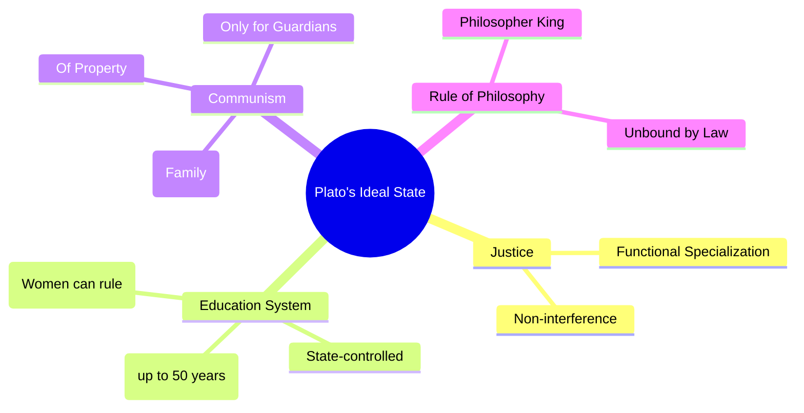

# 📖 Semester 1 | CC-102: Western Political Thought
## Unit 1: Ancient Greek Political Thought (Plato & Aristotle)

---

## 1. Introduction to Greek Political Thought (यूनानी राजनीतिक चिंतन का परिचय)

**English:**
Western Political Thought originated in Ancient Greece (Athens and Sparta) around the 5th century BCE. The Greeks were the first to systematically study politics, focusing on the concepts of the 'City-State' (*Polis*), Justice, Virtue, and the Ideal State.

**Hindi (हिंदी व्याख्या):**
पश्चिमी राजनीतिक चिंतन की उत्पत्ति प्राचीन यूनान (एथेंस और स्पार्टा) में 5वीं शताब्दी ईसा पूर्व के आसपास हुई थी। यूनानियों ने ही सबसे पहले राजनीति का व्यवस्थित अध्ययन शुरू किया, जिसमें उनका मुख्य ध्यान 'नगर-राज्य' (*Polis*), न्याय (Justice), सद्गुण (Virtue) और 'आदर्श राज्य' (Ideal State) की अवधारणाओं पर था।

---

## 2. PLATO (427 – 347 BCE) - The Father of Political Philosophy

### A. Biographical & Historical Background
- Born into an aristocratic Athenian family.
- Student of **Socrates**; deeply affected by Socrates' execution by the Athenian democracy.
- Founded **The Academy** in Athens (the first institution of higher learning in the Western world).

### B. Important Books by Plato
1. **The Republic** (Focuses on Justice and the Ideal State) - *Subtitle: Concerning Justice*
2. **The Statesman** (Focuses on the classification of states)
3. **The Laws** (His last work; focuses on the rule of law rather than philosopher kings)

### C. Theory of Justice (प्लेटो का न्याय सिद्धांत)
- Plato's concept of justice is **moral**, not legal. It means "doing one's own duty according to one's nature and not interfering in others' affairs."
- He divided the human soul into three parts, mapping them to three social classes:

| Element of Soul (आत्मा का तत्व) | Dominant Virtue (सद्गुण) | Social Class (सामाजिक वर्ग) | Function (कार्य) |
| :--- | :--- | :--- | :--- |
| Reason (विवेक) | Wisdom (बुद्धिमत्ता) | Philosopher Kings (दार्शनिक राजा) | Rule (शासन करना) |
| Spirit/Courage (साहस) | Courage (शौर्य) | Soldiers/Auxiliaries (सैनिक) | Defense (रक्षा करना) |
| Appetite (क्षुधा/इच्छा) | Temperance (संयम) | Artisans/Producers (उत्पादक) | Production (उत्पादन) |

### D. The Philosopher King & Communism
- **Philosopher King:** Those ruled by 'Reason' should govern because they know the "Form of the Good."
- **Communism (साम्यवाद):** To prevent corruption, Plato proposed Communism of **Property** and **Wives/Family** *only* for the guardian classes (Rulers and Soldiers). Producers were exempt.

---

## 3. ARISTOTLE (384 – 322 BCE) - The Father of Political Science

### A. Biographical & Historical Background
- Student of Plato; teacher of Alexander the Great.
- Founded **The Lyceum**.
- Unlike Plato (who was an idealist/deductive), Aristotle was a **Realist/Empiricist** who used the inductive method. He studied 158 constitutions before writing his masterpiece.

### B. Important Books
1. **The Politics** (The foundational text of comparative politics)
2. **Nicomachean Ethics** (Focuses on virtue and human flourishing/Eudaimonia)

### C. Origin and Nature of the State (राज्य की उत्पत्ति और प्रकृति)
- **Famous Quote:** *"Man is by nature a political animal."* (मनुष्य स्वभाव से एक राजनीतिक प्राणी है।)
- The State is a natural institution. It evolved organically: Family ➡️ Village ➡️ State (Polis).
- **Teleological View:** The State comes into existence for the sake of life, but continues for the sake of a *good life*.
- The State is logically prior to the individual.

### D. Classification of Governments (सरकारों का वर्गीकरण)
Aristotle classified states based on two criteria: **Number of rulers** (Who rules?) and **Purpose of rule** (Is it for public good or selfish interest?).

| Number of Rulers | Normal/Pure Form (Public Interest) | Corrupt/Perverted Form (Self Interest) |
| :--- | :--- | :--- |
| **One** | Monarchy (राजतंत्र) | Tyranny (निरंकुश तंत्र) |
| **Few** | Aristocracy (कुलीन तंत्र) | Oligarchy (गुटतंत्र/धनिक तंत्र) |
| **Many** | Polity (संवैधानिक तंत्र - Best Practicable) | Democracy (लोकतंत्र/भीड़तंत्र - Worst) |

> [!TIP]
> **Exam Trick:** Aristotle considered **Monarchy** as the best theoretically, but **Polity** (rule by the middle class) as the *best practicable* state because it offers stability (Golden Mean).

---

## 4. Comparative Analysis (Plato vs. Aristotle)

| Feature | Plato | Aristotle |
| :--- | :--- | :--- |
| **Methodology** | Deductive, Idealistic, Utopian | Inductive, Realistic, Empirical |
| **The State** | Focus on the Ideal State | Focus on the Best Practicable State (Polity) |
| **Rule of Law** | Rejected in 'Republic' (Philosopher King > Law) | Supported (Law > Any King) |
| **Property/Family**| Abolished for Guardians (Communism) | Supported private property and family for all |
| **Women** | Believed women can be rulers | Patriarchal view; restricted women to household |

---

## 5. Exam-Oriented Summary & Revision Notes

### 🧠 Rapid Revision Notes
- **Plato's Justice:** Doing one's own duty based on natural aptitude.
- **Plato's Communism:** Applicable only to Rulers and Soldiers to prevent nepotism and greed.
- **Aristotle's State:** A natural, organic institution essential for the "good life".
- **Aristotle's Polity:** The rule of the middle class; the golden mean between extreme wealth (Oligarchy) and extreme poverty (Democracy).

### 💡 Mnemonics
> **Plato's Classes & Soul:** **R-S-A** 
> **R**eason (Rulers), **S**pirit (Soldiers), **A**ppetite (Artisans)

> **Aristotle's Evolution of State:** **F-V-S**
> **F**amily ➡️ **V**illage ➡️ **S**tate

---

## 6. Question Bank & Model Answers

### A. Very Short Questions (2 Marks)
**Q1. Name the educational institution founded by Plato and Aristotle respectively.**
*Ans:* Plato founded 'The Academy' and Aristotle founded 'The Lyceum'.

**Q2. Why does Aristotle call man a 'political animal'?**
*Ans:* Because humans possess speech and reason, enabling them to debate justice and ethics, which can only be fully realized within a political community (the State).

### B. Long Analytical Questions (12.5 / 15 Marks)
**Q3. "The State comes into existence originating in the bare needs of life, and continuing in existence for the sake of a good life." Explain this statement by Aristotle. (BBMKU PYQ)**

**Model Answer Outline:**
1. **Introduction:** Briefly introduce Aristotle as the Father of Political Science and mention his book *The Politics*.
2. **Organic Evolution of the State:** Explain the chronological evolution from Family (reproduction/daily needs) ➡️ Village (security/social needs) ➡️ State (highest moral needs).
3. **Teleological Approach:** Explain that everything in nature has an end purpose (Telos). The purpose of the State is not just survival, but 'Eudaimonia' (human flourishing/good life).
4. **State is Prior to Individual:** Logically, the whole (State) is prior to the part (Individual). An individual outside the state is either a "beast or a god."
5. **Conclusion:** Summarize that for Aristotle, the State is the highest and most comprehensive human association, essential for moral development.

### C. UGC NET Specific MCQs (Paper II)
**Q1. According to Plato, the 'Appetite' element of the soul is represented by which social class?**
(A) Philosopher Kings
(B) Soldiers
(C) Artisans/Producers
(D) Slaves
*Answer:* (C) Artisans/Producers

**Q2. Which form of government did Aristotle consider as the "Best Practicable" state?**
(A) Monarchy
(B) Aristocracy
(C) Polity
(D) Democracy
*Answer:* (C) Polity

**Q3. Who among the following is associated with the 'Communism of Wives and Property'?**
(A) Aristotle
(B) Socrates
(C) Karl Marx
(D) Plato
*Answer:* (D) Plato

---

## 8. Phase 11 Mega Expansion: 20 High-Yield Questions

### Top 10 Short Questions (2-5 Marks)
**Q1. What is Plato's concept of 'Philosopher King'?**
*Ans:* A ruler who possesses true knowledge and wisdom, free from family and property ties, ensuring governance based on reason, not personal ambition.

**Q2. Define Aristotle's 'Distributive Justice'.**
*Ans:* It means distribution of offices, rewards, and honors according to an individual's merit and contribution to the state. It follows geometric proportion.

**Q3. How does Machiavelli differentiate between public and private morality?**
*Ans:* Machiavelli argued that private morality is based on ethics and religion, whereas public (state) morality is based solely on the preservation and expansion of state power (Reason of State).

**Q4. What is Hobbes' 'State of Nature'?**
*Ans:* A pre-social, pre-political condition characterized by a "war of every man against every man," where life is solitary, poor, nasty, brutish, and short.

**Q5. Explain John Locke's 'Tabula Rasa'.**
*Ans:* Locke believed the human mind at birth is a "blank slate" (tabula rasa), and all knowledge comes from experience and sensory perception, challenging the divine right theory.

**Q6. What are the three Natural Rights according to Locke?**
*Ans:* The right to Life, Liberty, and Property. The primary function of the state is to protect these pre-existing rights.

**Q7. Define Rousseau's 'General Will'.**
*Ans:* The collective, rational will of the citizens aiming at the common good. It is always right, indivisible, and sovereign.

**Q8. What is J.S. Mill's 'Harm Principle'?**
*Ans:* The only justification for state interference in an individual's liberty is to prevent harm to others (distinction between self-regarding and other-regarding actions).

**Q9. How does Marx define 'Class Struggle'?**
*Ans:* The fundamental conflict in capitalist society between the bourgeoisie (owners of production) and the proletariat (workers), which drives historical change.

**Q10. What is 'Historical Materialism' in Marxism?**
*Ans:* The theory that material and economic conditions (base) determine the social, political, and ideological structure (superstructure) of any society.

---

### Top 10 Long Analytical Questions (15-20 Marks)
**Q1. Critically examine Plato's Theory of Justice. Is it relevant today?**
*Outline:* Intro (The Republic context) -> Three parts of soul (Reason, Spirit, Appetite) -> Three classes -> Functional Specialization and Non-interference -> Criticism (Totalitarian, anti-democratic) -> Modern relevance (need for specialized, uncorrupted leadership).

**Q2. Compare and contrast the Social Contract theories of Hobbes, Locke, and Rousseau.**
*Outline:* Intro -> Human Nature (Hobbes: selfish, Locke: rational, Rousseau: noble savage) -> State of Nature -> Nature of Contract (Hobbes: absolute sovereign, Locke: limited government, Rousseau: popular sovereignty/General Will) -> Conclusion.

**Q3. "Machiavelli is the first modern political thinker." Discuss.**
*Outline:* Intro (context of Renaissance Italy) -> Separation of Politics from Ethics and Religion -> Concept of Nation-State -> Realism and Human Nature -> Statecraft (Lion and Fox) -> Conclusion (Foundation of modern realpolitik).

**Q4. Evaluate J.S. Mill's revision of Bentham's Utilitarianism.**
*Outline:* Intro (Bentham's quantitative utility: pushpin = poetry) -> Mill's qualitative distinction (higher vs lower pleasures) -> "Better to be Socrates dissatisfied than a fool satisfied" -> Emphasis on Liberty -> Conclusion.

**Q5. Analyze Karl Marx's critique of Capitalism and his vision of a Communist society.**
*Outline:* Intro -> Theory of Surplus Value -> Alienation (4 types) -> Inevitability of Capitalism's collapse -> Dictatorship of the Proletariat -> Stateless, classless society (Communism) -> Conclusion.

**Q6. Discuss Aristotle's classification of Constitutions.**
*Outline:* Intro -> Basis of classification (Number of rulers vs Purpose of rule) -> Normal forms (Monarchy, Aristocracy, Polity) -> Perverted forms (Tyranny, Oligarchy, Democracy) -> Why Polity is the golden mean -> Conclusion.

**Q7. Examine Locke's views on Property.**
*Outline:* Intro -> Property as a natural right -> Labor theory of property (mixing labor with nature) -> Limitations (spoilage, sufficiency) -> Invention of money -> Impact on modern liberalism.

**Q8. Explain Hegel's Dialectical Idealism and how Marx inverted it.**
*Outline:* Intro -> Hegel's dialectic (Thesis, Antithesis, Synthesis) -> The 'Idea' as the driving force of history -> State as the march of God on earth -> Marx's inversion (Dialectical Materialism - matter, not idea, drives history) -> Conclusion.

**Q9. Evaluate Rousseau's paradox: "Man is forced to be free."**
*Outline:* Intro (The Social Contract) -> The General Will vs Particular Will -> Submission to the General Will is submission to one's own rational self -> Therefore, coercion by the state is forcing a person to be their true, free self -> Totalitarian implications.

**Q10. Discuss T.H. Green's concept of Positive Liberty.**
*Outline:* Intro (Shift from negative to positive liberalism) -> Liberty as the positive power to do something worth doing -> State as a hindrance to hindrances -> Moral development of the individual -> Conclusion.

---

> [!IMPORTANT]
> ### 🎓 UGC NET Expert Tips for Western Political Thought
> 1. **Chronology is King:** NTA frequently asks you to arrange books (e.g., Plato's *Republic, Statesman, Laws*) or thinkers in chronological order.
> 2. **Exact Quotes:** Memorize famous quotes. Example: Bentham's "Pushpin is as good as poetry" or Hobbes' "Life is solitary, poor, nasty, brutish, and short."
> 3. **Match the Following:** Be prepared to match Thinkers with their core concepts (e.g., Locke - Fiduciary Trust; Rousseau - Popular Sovereignty).
> 4. **Dialectics:** Clearly understand the difference between Hegel's *Dialectical Idealism* and Marx's *Dialectical Materialism*. This is a highly repeated Assertion-Reasoning topic.

---
*Created as part of the BBMKU M.A. Political Science & UGC NET Master Dashboard Project.*
