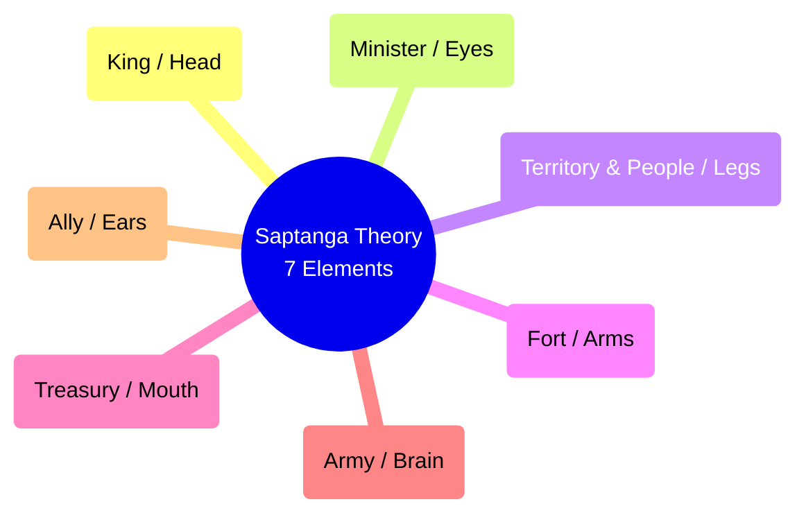

# 📖 Semester 1 | CC-103: Indian Political Thought
## Unit 1: Ancient Indian Political Thought (Manu & Kautilya)

---

## 1. Introduction to Ancient Indian Political Thought (प्राचीन भारतीय राजनीतिक चिंतन का परिचय)

**English:**
Unlike Western thought which separated religion and politics early on, Ancient Indian Political Thought is deeply embedded in religion, ethics, and morality, collectively known as **Dharma**. The state was not an end in itself but a means to uphold Dharma. The primary sources of ancient Indian political thought include the Vedas, Epics (Ramayana, Mahabharata), Smritis (Manusmriti), and Arthashastra.

**Hindi (हिंदी व्याख्या):**
पश्चिमी चिंतन (जहाँ धर्म और राजनीति को अलग रखा गया) के विपरीत, प्राचीन भारतीय राजनीतिक चिंतन धर्म, नैतिकता और सदाचार (Dharma) में गहराई से निहित है। राज्य अपने आप में कोई साध्य (End) नहीं था, बल्कि धर्म को बनाए रखने का एक साधन (Means) था। प्राचीन भारतीय राजनीतिक चिंतन के प्राथमिक स्रोत वेद, महाकाव्य (रामायण, महाभारत), स्मृतियाँ (मनुस्मृति) और अर्थशास्त्र हैं।

---

## 2. MANU (मनु)

### A. Biographical & Historical Background
- Manu is considered the first lawgiver of India and the progenitor of humanity in Hindu tradition.
- Author of **Manusmriti** (Manava Dharmashastra), the most authoritative text on ancient Indian social and legal codes.

### B. Divine Origin of State (राज्य की दैवीय उत्पत्ति)
- Manu supported the Divine Right of Kings. 
- He believed the King was created by God (Brahma) combining the eternal particles of eight supreme deities (Indra, Vayu, Yama, Surya, Agni, Varuna, Moon, and Kubera) to protect the people from anarchy (*Matsya Nyaya* or the Law of the Fish).

### C. The Concept of Dharma and Danda (धर्म और दंड)
- **Dharma:** The supreme law that regulates the universe and human society. Even the King is subordinate to Dharma.
- **Danda:** Coercive power or punishment. Manu argued that it is *Danda* that truly rules the subjects and protects all beings. The King is merely the wielder of Danda. 
- *"If the King did not untiringly inflict punishment on those to be punished, the stronger would roast the weaker like fish on a spit."*

### D. Varnashrama Dharma (वर्णाश्रम धर्म)
Manu strictly supported the fourfold division of society (Varna: Brahmin, Kshatriya, Vaishya, Shudra) and the four stages of life (Ashrama: Brahmacharya, Grihastha, Vanaprastha, Sanyasa).

---

## 3. KAUTILYA / CHANAKYA (कौटिल्य / चाणक्य)

### A. Biographical & Historical Background
- Chief advisor and Prime Minister to Chandragupta Maurya (4th Century BCE).
- Architect of the Mauryan Empire.
- Author of the **Arthashastra**, the greatest Indian treatise on statecraft, economic policy, and military strategy.

### B. Realism and Statecraft (यथार्थवाद और राज्यचक्र)
- Unlike Manu (who was highly moralistic), Kautilya was a pragmatist and realist, often compared to Machiavelli.
- For Kautilya, the ultimate goal of the state is expansion and the acquisition of wealth (*Artha*), because all other human pursuits depend on material well-being.

### C. Saptanga Theory of State (सप्तांग सिद्धांत)
Kautilya defined the state as an organism with seven interconnected elements (Prakritis).

### D. Mandala Theory (मंडल सिद्धांत - Foreign Policy)
- The core of Kautilya's foreign policy is that **"A direct neighbor is a natural enemy."**
- The Mandala is a circle of 12 kings consisting of the *Vijigishu* (the ambitious conqueror), his enemies, and his allies.

---

## 4. Comparative Analysis (Manu vs. Kautilya)

| Feature | Manu | Kautilya |
| :--- | :--- | :--- |
| **Primary Text** | Manusmriti (Dharmashastra) | Arthashastra |
| **Focus** | Social laws, ethics, and morality | Statecraft, diplomacy, and economics |
| **Nature of State** | Divine Origin | Pragmatic / Quasi-contractual |
| **View on King** | King is divine | King is a servant of the state, bound by duty |
| **Foreign Policy** | Secondary focus | Primary focus (Mandala Theory & Shadgunya) |

---

## 5. Exam-Oriented Summary & Revision Notes

### 🧠 Rapid Revision Notes
- **Matsya Nyaya:** The law of the jungle/fish (big fish eats small fish), to prevent which the state was created.
- **Saptanga Theory:** 7 elements of the state (Swami, Amatya, Janapada, Durga, Kosha, Danda, Mitra).
- **Mandala Theory:** Kautilya's geopolitics (circle of 12 kings).
- **Shadgunya Niti:** 6-fold foreign policy of Kautilya (Sandhi, Vigraha, Asana, Yana, Samshraya, Dvaidhibhava).

### 💡 Memory Tricks / Mnemonics
> **Kautilya's 7 Elements (Saptanga) Mnemonic:** **SAJDKDM** 
> **S**wami, **A**matya, **J**anapada, **D**urga, **K**osha, **D**anda, **M**itra

---

## 6. Question Bank & Model Answers

### A. Very Short Questions (2 Marks)
**Q1. What is Matsya Nyaya?**
*Ans:* Matsya Nyaya translates to the "Law of the Fish," referring to a state of anarchy where the strong oppress the weak (the big fish eats the small fish).

**Q2. Who is the *Vijigishu* in Kautilya's Mandala Theory?**
*Ans:* *Vijigishu* is the ambitious, central king in the Mandala who aspires to conquer and expand his territory.

### B. Long Analytical Questions (12.5 / 15 Marks)
**Q3. Discuss Kautilya's Saptanga theory of the state. (UGC NET & M.A. PYQ)**

**Model Answer Outline:**
1. **Introduction:** Introduce Kautilya and the *Arthashastra*. Mention that ancient Indian thinkers viewed the state as an organic whole rather than a machine.
2. **The Seven Elements (Prakritis):** Explain each element in detail:
   - *Swami:* The King, who must be energetic and virtuous.
   - *Amatya:* The bureaucracy/ministers.
   - *Janapada:* The territory and population.
   - *Durga:* Fortified capital for defense.
   - *Kosha:* The treasury, essential for state activities.
   - *Danda/Bala:* The military force.
   - *Mitra:* The ally, essential in times of crisis.
3. **Organic Interdependence:** Explain how Kautilya compared these elements to the human body. No element can function in isolation, though the *Swami* is the most important.
4. **Relevance today:** The elements perfectly align with modern elements of the state (Population, Territory, Government, Sovereignty + Economy & Diplomacy).
5. **Conclusion:** Summarize Kautilya's genius in conceptualizing a comprehensive theory of the state centuries before Western thinkers.

### C. UGC NET Specific MCQs (Paper II)
**Q1. In Kautilya's Saptanga theory, 'Amatya' refers to:**
(A) The King
(B) The Territory
(C) The Ministers/Officials
(D) The Treasury
*Answer:* (C) The Ministers/Officials

**Q2. Which ancient Indian text provides the most comprehensive account of statecraft and foreign policy?**
(A) Rig Veda
(B) Manusmriti
(C) Arthashastra
(D) Upanishads
*Answer:* (C) Arthashastra

**Q3. According to Kautilya's Mandala theory, the king whose territory is situated immediately adjacent to the *Vijigishu* is inherently a:**
(A) Mitra (Ally)
(B) Ari (Enemy)
(C) Udasina (Neutral)
(D) Madhyama (Intermediary)
*Answer:* (B) Ari (Enemy)

---

---

## 8. Phase 11 Mega Expansion: 20 High-Yield Questions

### Top 10 Short Questions (2-5 Marks)
**Q1. What is the core essence of 'Dharma' in ancient Indian thought?**
*Ans:* Dharma refers to duty, cosmic order, and righteous conduct. It is the guiding principle of the state (Rajadharma) holding society together, not merely religion.

**Q2. Explain Kautilya's concept of 'Amatya'.**
*Ans:* Amatya refers to high-ranking officials and ministers in the Saptanga theory. They act as the "eyes" of the king, providing counsel and executing policies.

**Q3. What are the four Upayas (diplomatic strategies) according to Manu and Kautilya?**
*Ans:* Sama (Conciliation/Diplomacy), Dana (Gifts/Bribes), Bheda (Sowing dissension), and Danda (Force/Punishment).

**Q4. Describe Rammohan Roy's views on the Press.**
*Ans:* He was a staunch advocate for the Freedom of the Press, believing it essential for public enlightenment, criticizing unjust laws, and communicating Indian grievances to the British.

**Q5. What is the 'Drain Theory' formulated by Dadabhai Naoroji?**
*Ans:* The theory that British colonial rule systematically drained India's wealth and resources to Britain through unrequited exports, administrative charges, and pensions, leading to Indian poverty.

**Q6. What does Gandhi mean by 'Satyagraha'?**
*Ans:* Truth-force or soul-force. It is a non-violent method of resistance based on truth and love, aiming to convert the oppressor's heart rather than defeating them.

**Q7. Explain Gandhi's concept of 'Trusteeship'.**
*Ans:* An economic philosophy where wealthy individuals act as 'trustees' of their wealth, keeping only what is necessary for their needs and using the surplus for the welfare of society.

**Q8. What is 'Radical Humanism' as proposed by M.N. Roy?**
*Ans:* A philosophy rejecting both Marxism and bourgeois democracy, placing the individual at the center. It emphasizes reason, morality, and freedom, free from religious or nationalist dogma.

**Q9. Define B.R. Ambedkar's concept of 'Annihilation of Caste'.**
*Ans:* The complete destruction of the caste system and the religious texts (Shastras) that sanction it, which he deemed necessary for achieving true liberty, equality, and fraternity in India.

**Q10. What is 'Total Revolution' (Sampoorna Kranti) by Jayaprakash Narayan?**
*Ans:* A call for a comprehensive transformation of society across seven dimensions: political, economic, social, cultural, ideological, educational, and moral, aiming for a true participatory democracy.

---

### Top 10 Long Analytical Questions (15-20 Marks)
**Q1. Critically examine Kautilya's Saptanga Theory of State.**
*Outline:* Intro -> The organic nature of the state -> Seven limbs (Swami, Amatya, Janapada, Durga, Kosha, Danda, Mitra) -> Interdependence of limbs -> Comparison with Western organic theories -> Conclusion.

**Q2. Evaluate Kautilya's Mandala Theory and its relevance to modern International Relations.**
*Outline:* Intro -> Concept of Vijigishu (conqueror) -> The geopolitical arrangement of 12 states (Ari, Mitra, Ari-Mitra, etc.) -> Udasina and Madhyama -> Modern relevance (Balance of Power, Realpolitik) -> Conclusion.

**Q3. Discuss the contribution of Raja Rammohan Roy to Indian political and social thought.**
*Outline:* Intro (Father of Indian Renaissance) -> Social reforms (Abolition of Sati) -> Political views (Freedom of Press, Civil Rights) -> Economic views -> Universalism and religious reform -> Conclusion.

**Q4. Analyze the political philosophy of Bal Gangadhar Tilak.**
*Outline:* Intro (Extremist leader) -> Concept of Swaraj ("Swaraj is my birthright") -> Nationalism based on cultural revival (Ganapati, Shivaji festivals) -> Means of struggle (Boycott, Swadeshi, National Education) -> Difference from Gokhale -> Conclusion.

**Q5. "Gandhi's concept of Swaraj is multidimensional." Elucidate.**
*Outline:* Intro -> Political Swaraj (Self-rule, decentralization) -> Economic Swaraj (Khadi, self-reliance) -> Spiritual/Internal Swaraj (Self-mastery, control over senses) -> Hind Swaraj (Critique of modern western civilization) -> Conclusion.

**Q6. Critically evaluate the debate between Gandhi and Ambedkar on the issue of Caste and Untouchability.**
*Outline:* Intro -> Gandhi's view (Eradicate untouchability but maintain idealized Varna system, Harijan approach) -> Ambedkar's view (Caste is inherently unequal, requires complete annihilation, critique of Hinduism) -> Poona Pact context -> Conclusion.

**Q7. Discuss M.N. Roy's critique of Marxism and his transition to Radical Humanism.**
*Outline:* Intro -> Early phase as a Marxist -> Disillusionment with Stalinism and party dictatorship -> Critique of economic determinism -> Core tenets of Radical Humanism (Reason, individual freedom) -> Conclusion.

**Q8. Examine Jawaharlal Nehru's ideas on Democratic Socialism and Secularism.**
*Outline:* Intro -> Synthesis of liberal democracy and socialist economics -> Mixed economy and planning -> Secularism (Sarva Dharma Sambhava, state neutrality) -> Scientific temper -> Conclusion.

**Q9. Evaluate Ram Manohar Lohia's concept of 'Sapta Kranti' (Seven Revolutions).**
*Outline:* Intro -> Socialist background -> The seven revolutions (Gender equality, anti-caste, anti-colonialism, against private property, civil liberties, non-violence, etc.) -> Relevance for Indian socialism -> Conclusion.

**Q10. Discuss Savarkar's concept of 'Hindutva'.**
*Outline:* Intro -> Distinction between Hinduism (religion) and Hindutva (cultural/national identity) -> Criteria for Hindutva (Pitribhu, Punyabhu, shared culture/blood) -> Political implications for Indian nationalism -> Conclusion.

---

> [!IMPORTANT]
> ### 🎓 UGC NET Expert Tips for Indian Political Thought
> 1. **Debates and Clashes:** NTA loves asking about ideological clashes. Clearly differentiate Gandhi vs. Ambedkar (Caste), Gandhi vs. Tagore (Nationalism), and Tilak vs. Gokhale (Means of struggle).
> 2. **Books and Journals:** Memorize the exact names of journals. (e.g., Ambedkar's *Mooknayak, Bahishkrit Bharat*; Gandhi's *Harijan, Young India*).
> 3. **Chronology of Social Movements:** You must know the sequence of establishments like Brahmo Samaj, Arya Samaj, Satya Shodhak Samaj, etc.
> 4. **Ancient Texts:** Do not ignore Manu, Kautilya, and Agganna Sutta. Questions on the Saptanga limbs and Mandala theory are virtually guaranteed.

---
*Created as part of the BBMKU M.A. Political Science & UGC NET Master Dashboard Project.*
