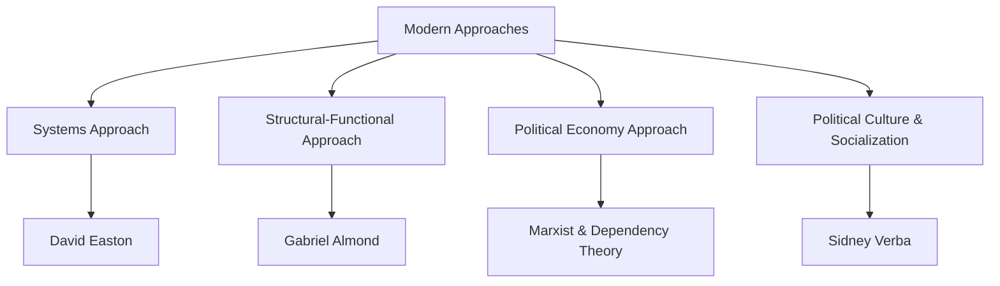

# 📖 Semester 1 | CC-104: Comparative Political Analysis
## Unit 1: Nature, Scope, and Approaches (Traditional & Modern)

---

## 1. Meaning & Definition (अर्थ एवं परिभाषा)

**English:**
Comparative Politics is the systematic study and comparison of the world's political systems. It explains the differences and similarities between political systems, structures, institutions, and political behavior across various countries. 

**Hindi (हिंदी व्याख्या):**
तुलनात्मक राजनीति (Comparative Politics) दुनिया की विभिन्न राजनीतिक प्रणालियों का व्यवस्थित अध्ययन और तुलना है। यह विभिन्न देशों की राजनीतिक व्यवस्थाओं, संरचनाओं, संस्थाओं और राजनीतिक व्यवहार के बीच समानताओं और अंतरों की व्याख्या करता है।

| Scholar | Definition | Key Concept |
| :--- | :--- | :--- |
| **Edward Freeman** | "Comparative Politics is comparative analysis of the various forms of government and diverse political institutions." | Institutions |
| **Macridis & Ward**| "Comparative politics is the study of patterns of national governments in the contemporary world." | Patterns of Government |

---

## 2. Evolution of Comparative Politics (विकास)

The evolution of comparative politics can be broadly divided into three phases:
1. **Ancient Phase:** Aristotle is the father of comparative politics. He studied 158 Greek constitutions to classify governments.
2. **Traditional Phase (till WWII):** Focused on institutions, constitutions, and legal frameworks (e.g., comparing the US Constitution with the UK Parliament). It was highly formal, normative, and Eurocentric.
3. **Modern Phase (Post WWII):** Driven by the Behavioral Revolution. Focus shifted from *institutions* to *behavior, processes, and systems*. It expanded beyond Europe to study developing nations (Third World).

---

## 3. Approaches to the Study of Comparative Politics (दृष्टिकोण)

### A. Traditional Approaches (परंपरागत दृष्टिकोण)
These approaches dominated before the 1950s.
1. **Philosophical Approach:** Focuses on values and what the state *ought* to be.
2. **Historical Approach:** Explains political institutions through their historical evolution.
3. **Institutional Approach:** Focuses on formal structures like the Executive, Legislature, and Judiciary.
4. **Legal Approach:** Studies the state as an organization for creating and enforcing laws.

*Criticism of Traditional Approaches:* They were descriptive, static, culture-bound (Eurocentric), and ignored informal realities like voting behavior and pressure groups.

### B. Modern Approaches (आधुनिक दृष्टिकोण)
Emerged to make political science more scientific and universally applicable.

#### 1. Systems Approach (David Easton)
- Compares political systems based on how they process **Inputs** (Demands and Supports) into **Outputs** (Decisions and Policies) through a conversion process (the Government).
- It involves a **Feedback Loop** where outputs affect future inputs.

#### 2. Structural-Functional Approach (Gabriel Almond & Bingham Powell)
- An adaptation of the Systems approach to make it applicable to non-Western/developing nations.
- Argues that all political systems have certain structures that perform specific functions.
- **Input Functions:** Political socialization, interest articulation, interest aggregation, political communication.
- **Output Functions:** Rule-making, rule-application, rule-adjudication.

---

## 4. Nature and Scope (प्रकृति और क्षेत्र)

**Nature (प्रकृति):**
- It is empirical and scientific.
- It is interdisciplinary (borrows from sociology, psychology, economics).
- It aims at theory-building (creating generalizations that apply to multiple countries).

**Scope (विषय-क्षेत्र):**
- Study of Political Socialization and Culture.
- Study of Political Parties and Interest Groups.
- Study of Electoral Systems and Voting Behavior.
- Study of Development and Modernization in the Third World.

---

## 5. Exam-Oriented Summary & Revision Notes

### 🧠 Rapid Revision Notes
- **Father of Comparative Politics:** Aristotle (Studied 158 constitutions).
- **Traditional vs. Modern:** Traditional is formal/legal/Eurocentric. Modern is informal/behavioral/Global.
- **Systems Approach (Easton):** Input ➡️ Conversion ➡️ Output ➡️ Feedback.
- **Structural-Functional (Almond):** Focuses on *what* structures exist and *how* they function (Input/Output functions).

### 💡 Memory Tricks / Mnemonics
> **Almond's Input Functions Mnemonic:** **S-A-A-C**
> Political **S**ocialization, Interest **A**rticulation, Interest **A**ggregation, Political **C**ommunication.

---

## 6. Question Bank & Model Answers

### A. Very Short Questions (2 Marks)
**Q1. Who applied the Systems Approach to Comparative Politics?**
*Ans:* David Easton applied the Systems Approach, viewing the political system as a mechanism that converts inputs into outputs.

**Q2. Mention two features of the Traditional Approach to comparative politics.**
*Ans:* 1. It is highly formal and focuses on legal institutions (like constitutions). 2. It is normative and predominantly Eurocentric.

### B. Long Analytical Questions (12.5 / 15 Marks)
**Q3. Critically analyze the Structural-Functional approach of Gabriel Almond. (UGC NET & M.A. PYQ)**

**Model Answer Outline:**
1. **Introduction:** Briefly define comparative politics. Explain that the structural-functional approach emerged because traditional institutional approaches failed to explain the politics of newly independent developing nations.
2. **Core Concept:** Almond argued that instead of comparing 'institutions' (like Parliament vs. Congress), we should compare 'structures' and the 'functions' they perform, as similar functions can be performed by different structures in different countries.
3. **Input Functions:** Detail the 4 input functions (Socialization, Articulation, Aggregation, Communication).
4. **Output Functions:** Detail the 3 output functions (Rule-making, Rule-application, Rule-adjudication).
5. **Criticism:** It has a conservative bias (focuses on maintaining stability rather than explaining rapid revolutionary change), and its terminology is excessively complex.
6. **Conclusion:** Despite criticisms, it remains one of the most comprehensive frameworks for comparing vastly different political systems globally.

### C. UGC NET Specific MCQs (Paper II)
**Q1. The concept of "Political System" as a set of interactions extracting inputs and producing outputs was formulated by:**
(A) Gabriel Almond
(B) David Easton
(C) Robert Dahl
(D) Karl Deutsch
*Answer:* (B) David Easton

**Q2. Interest Articulation is primarily the function of:**
(A) Political Parties
(B) Legislature
(C) Pressure Groups / Interest Groups
(D) Judiciary
*Answer:* (C) Pressure Groups / Interest Groups

**Q3. Which of the following is a characteristic of the Traditional approach to comparative politics?**
(A) Empirical
(B) Behavioral
(C) Interdisciplinary
(D) Normative and Institutional
*Answer:* (D) Normative and Institutional

---

---

## 8. Phase 11 Mega Expansion: 20 High-Yield Questions

### Top 10 Short Questions (2-5 Marks)
**Q1. What is the difference between 'Comparative Government' and 'Comparative Politics'?**
*Ans:* Comparative Government studies formal political institutions (executive, legislature, judiciary). Comparative Politics is broader; it studies formal institutions as well as informal processes (voting behavior, pressure groups, political culture).

**Q2. Define David Easton's 'Input-Output Model'.**
*Ans:* A behavioral model where the political system receives 'inputs' (demands and supports) from the environment and converts them into 'outputs' (decisions and policies) through a conversion process.

**Q3. What is 'Political Socialization' according to Almond and Powell?**
*Ans:* The process by which individuals learn and internalize political values, beliefs, and attitudes. Agents include family, school, peer groups, and media.

**Q4. Explain the concept of 'Interest Articulation'.**
*Ans:* The process by which individuals and groups make their demands known to the political decision-makers, typically performed by pressure groups and interest groups.

**Q5. What is 'Interest Aggregation'?**
*Ans:* The process of combining various articulated demands into coherent policy programs, typically performed by political parties.

**Q6. Define 'Political Culture' as given by Almond and Verba.**
*Ans:* The set of attitudes, beliefs, and sentiments that give order and meaning to a political process. They classified it into Parochial, Subject, and Participant cultures.

**Q7. What is 'Political Modernization'?**
*Ans:* The transition of a traditional society to a modern one, characterized by increased political participation, rational-legal authority, secularization, and institutional differentiation.

**Q8. Differentiate between Federal and Unitary systems.**
*Ans:* In a federal system, power is divided constitutionally between a central government and state/regional governments (e.g., USA, India). In a unitary system, all power is concentrated in the central government (e.g., UK, France).

**Q9. What is 'Constitutionalism'?**
*Ans:* The principle that government authority is derived from and limited by a body of fundamental law (the Constitution), ensuring limited government and protection of individual rights.

**Q10. Explain the 'Rule of Law' (A.V. Dicey).**
*Ans:* The principle that no one is above the law, laws are applied equally to all, and no one can be punished except for a distinct breach of law established in the ordinary legal manner.

---

### Top 10 Long Analytical Questions (15-20 Marks)
**Q1. Discuss the nature, scope, and evolution of Comparative Politics.**
*Outline:* Intro -> Traditional approach (institutional, formal, normative) -> Behavioral revolution (empirical, interdisciplinary, focus on processes) -> Post-behavioralism -> Modern scope (political culture, development, global systems) -> Conclusion.

**Q2. Critically examine the Structural-Functional approach of Gabriel Almond.**
*Outline:* Intro -> Critique of Easton's model -> System, Structure, and Function -> 4 Input functions (Socialization, Articulation, Aggregation, Communication) -> 3 Output functions (Rule-making, application, adjudication) -> Criticism (conservative, ethnocentric) -> Conclusion.

**Q3. Analyze David Easton's Systems Approach in Comparative Politics.**
*Outline:* Intro -> Environment (intra-societal and extra-societal) -> Inputs (Demands and Supports) -> The "Black Box" (Conversion Process) -> Outputs (Policies) -> Feedback Loop -> Criticism -> Conclusion.

**Q4. Evaluate the concept of Political Culture with special reference to Almond and Verba's 'The Civic Culture'.**
*Outline:* Intro -> Definition of Political Culture -> Three pure types (Parochial, Subject, Participant) -> The 'Civic Culture' (a mix of all three, ideal for stable democracy, based on their 5-nation study) -> Criticism -> Conclusion.

**Q5. Discuss the theories of Political Development formulated by Lucian Pye and Samuel Huntington.**
*Outline:* Intro -> Pye's Development Syndrome (Equality, Capacity, Differentiation) -> Huntington's theory of Political Decay (if mobilization outpaces institutionalization, decay occurs) -> Conclusion.

**Q6. Compare the Presidential system of the USA with the Parliamentary system of the UK.**
*Outline:* Intro -> Separation of powers vs Fusion of powers -> Head of State vs Head of Government -> Checks and balances (US) vs Parliamentary sovereignty (UK) -> Rigidity vs Flexibility -> Conclusion.

**Q7. Analyze the role and functions of Political Parties in modern democracies.**
*Outline:* Intro -> Definition -> Functions (Interest aggregation, contesting elections, forming government/opposition, political socialization) -> Party systems (One, Two, Multi-party) -> Conclusion.

**Q8. Critically evaluate the Marxist approach to Comparative Politics.**
*Outline:* Intro -> Focus on economic base (mode of production) rather than political superstructure -> Class struggle as the engine of politics -> State as an instrument of the ruling class -> Neo-Marxist developments -> Criticism -> Conclusion.

**Q9. Discuss the Elite Theories of Power (Mosca, Pareto, and Michels).**
*Outline:* Intro -> The inevitability of elitism -> Pareto's 'Circulation of Elites' (Lions and Foxes) -> Mosca's 'Ruling Class' -> Michels' 'Iron Law of Oligarchy' -> Implications for democracy -> Conclusion.

**Q10. Evaluate the role of Pressure Groups in the political process.**
*Outline:* Intro -> Difference from political parties (seek influence, not power) -> Types of groups (Anomic, Non-associational, Institutional, Associational) -> Techniques (Lobbying, strikes, media) -> Conclusion.

---

> [!IMPORTANT]
> ### 🎓 UGC NET Expert Tips for Comparative Politics
> 1. **Almond & Verba's Study:** NTA always asks about the 5 countries studied in *The Civic Culture* (USA, UK, Germany, Italy, Mexico). Memorize them!
> 2. **Lucian Pye's Syndrome:** The three characteristics of Political Development (Equality, Capacity, Differentiation) are a highly repeated MCQ.
> 3. **Input-Output Match:** Be careful matching functions to Almond's structures (e.g., Interest Articulation = Pressure Groups; Rule-making = Legislature).
> 4. **Huntington's Decay:** Understand that rapid social mobilization without institutional development leads to 'Political Decay', not development.

---
*Created as part of the BBMKU M.A. Political Science & UGC NET Master Dashboard Project.*
