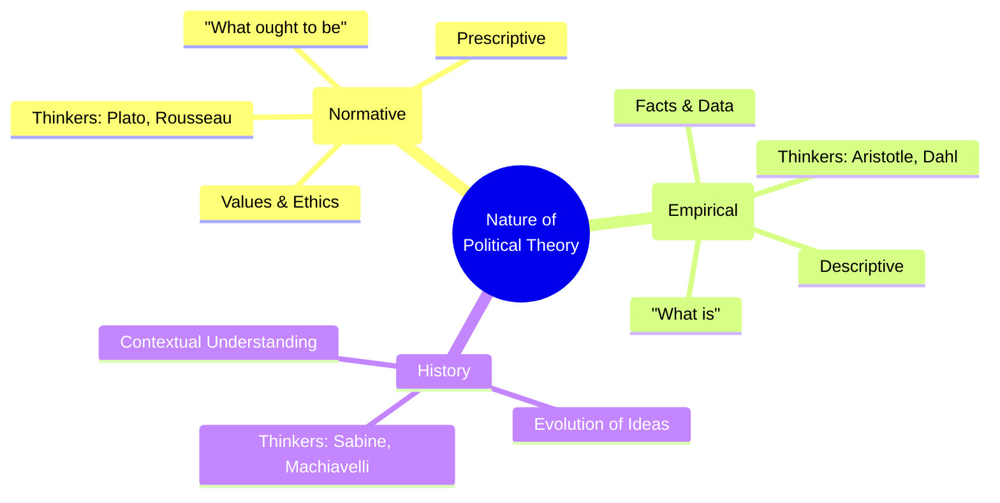
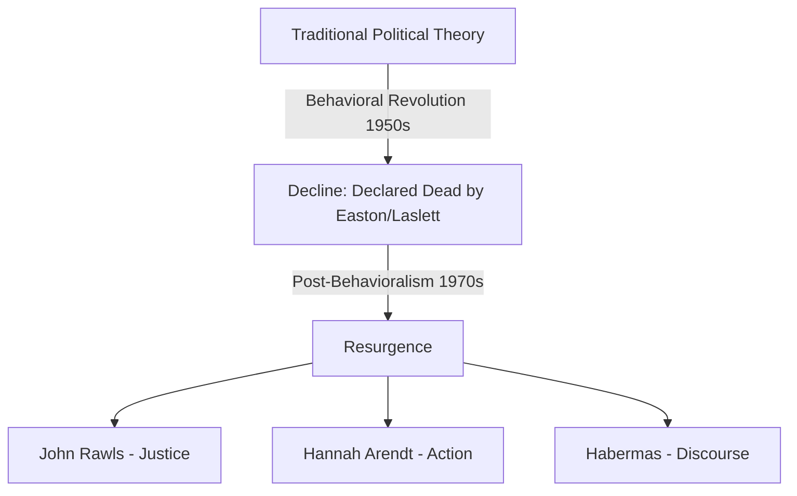

# 📖 Semester 1 | FC-101: Political Theory
## Unit 1: Nature, Scope, and Significance of Political Theory

---

## 1. Meaning & Origin (अर्थ एवं उत्पत्ति)

**English:**
The term 'Political Theory' is composed of two words: 'Political' and 'Theory'. 
- **Political** comes from the Greek word *'Polis'*, meaning City-State.
- **Theory** comes from the Greek word *'Theoria'*, meaning a well-focused mental look taken at something in a state of contemplation (i.e., a systematic reflection).
Political Theory is the systematic study of political ideas, institutions, and behavior. It seeks to understand, explain, and evaluate the political world.

**Hindi (हिंदी व्याख्या):**
'राजनीतिक सिद्धांत' (Political Theory) ग्रीक शब्द *'Polis'* (नगर-राज्य) और *'Theoria'* (व्यवस्थित चिंतन) से मिलकर बना है। यह राजनीतिक विचारों, संस्थाओं और व्यवहार का एक व्यवस्थित और दार्शनिक अध्ययन है जिसका उद्देश्य राजनीतिक दुनिया को समझना, समझाना और उसका मूल्यांकन करना है।

---

## 2. Definitions by Important Scholars (प्रमुख विद्वानों द्वारा परिभाषाएँ)

| Scholar / Thinker | Definition / Quote | Key Concept |
| :--- | :--- | :--- |
| **George Sabine** | "Political theory is quite simply man's attempts to consciously understand and solve the problems of his group life and organization." | Group Life & Problem Solving |
| **David Held** | "Political theory is a network of concepts and generalizations about political life involving ideas, assumptions and statements about the nature, purpose and key features of government." | Network of Concepts |
| **Andrew Hacker** | "Political theory is a combination of a disinterested search for the principles of good state and good society, and a disinterested search for knowledge of political and social reality." | Philosophy + Science |

---

## 3. Nature of Political Theory (राजनीतिक सिद्धांत की प्रकृति)

Political Theory has a dual nature, combining both philosophy (values/what ought to be) and science (facts/what is).

### Characteristics (विशेषताएँ):
1. **Systematic Body of Knowledge:** It relies on logical and rational analysis.
2. **Evaluative & Prescriptive:** It does not merely describe the state but prescribes the best form of government.
3. **Contextual:** Theories are deeply influenced by the time and space in which they are formulated (e.g., Hobbes' Leviathan during the English Civil War).

---

## 4. Scope & Objectives (कार्यक्षेत्र और उद्देश्य)

**Scope (विषय-क्षेत्र):**
1. **Study of the State and Government:** The origin, nature, and evolution of the state.
2. **Study of Power and Authority:** Who gets what, when, and how (Harold Lasswell).
3. **Study of Political Ideologies:** Liberalism, Marxism, Fascism, Feminism.
4. **Study of Concepts:** Liberty, Equality, Justice, Rights, Democracy.

**Objectives (उद्देश्य):**
- To provide moral criteria for evaluating political systems.
- To resolve conflicts and promote cooperation.
- To legitimize state authority.

---

## 5. Importance & Relevance (महत्व और प्रासंगिकता)

**Why study Political Theory?**
1. **Clarification of Concepts:** It clears up ambiguities around words like 'Freedom' and 'Equality'.
2. **Critical Evaluation:** It prevents blind conformity to the state.
3. **Social Engineering:** It guides policymakers and constitutions (e.g., Locke's theory of natural rights influenced the US Constitution).

**Modern Relevance & Current Affairs:**
In an era of rising authoritarianism, digital surveillance, and climate change, Political Theory provides the ethical framework to discuss *Digital Rights*, *Global Justice*, and *Environmental Citizenship* (Deep Ecology - Arne Naess).

---

## 6. Decline and Resurgence of Political Theory (पतन और पुनरुत्थान)

In the mid-20th century, Behavioralists claimed Political Theory was "dead." 

### The Decline (1950s - 1960s)
* **David Easton** argued that traditional theory relied too much on history and morals, lacking scientific rigor (Historicism).
* **Alfred Cobban** called it the "decline of political theory."
* **Peter Laslett** famously declared "For the moment, anyway, political philosophy is dead."

### The Resurgence (1970s onwards)
Political Theory was revived by thinkers who tackled real-world moral issues:
* **John Rawls (1971):** Published *A Theory of Justice*, bringing normative theory back to life.
* **Hannah Arendt:** Emphasized civic participation.
* **Jurgen Habermas:** Theory of Communicative Action.

---

## 7. Exam-Oriented Summary & Revision Notes

### 🧠 Short Notes / Rapid Revision
- **Political Theory = Political Science + Political Philosophy.**
- **Andrew Hacker's dualism:** Disinterested search for good state (Philosophy) + knowledge of reality (Science).
- **Decline Thinkers:** David Easton, Alfred Cobban, Peter Laslett, Robert Dahl.
- **Resurgence Thinkers:** John Rawls, Hannah Arendt, Leo Strauss, Isaiah Berlin.

### 💡 Memory Tricks / Mnemonics
> **Decline Thinkers Mnemonic:** **DECAL**
> **D**avid Easton, **E**mpirical focus, **C**obban, **A**lfred, **L**aslett

> **Resurgence Thinkers Mnemonic:** **RAH**
> **R**awls, **A**rendt, **H**abermas

---

## 8. Question Bank & Model Answers

### A. Very Short Questions (2 Marks)
**Q1. Define Political Theory according to George Sabine.**
*Ans:* George Sabine defines political theory as man's attempts to consciously understand and solve the problems of his group life and organization.

### B. Long Analytical Questions (12.5 / 15 Marks)
**Q2. Discuss the debate regarding the decline and resurgence of political theory in the 20th century. (UGC NET & M.A. PYQ)**

**Model Answer (University Level Outline):**
1. **Introduction:** Define Political Theory. Mention that the mid-20th century saw a major debate regarding its survival due to the rise of Behavioralism.
2. **The "Decline" Argument:** 
   - State the views of David Easton (Historicism, Moral Relativism).
   - Quote Peter Laslett ("Political philosophy is dead").
   - Explain how the focus shifted entirely to empirical, value-free science (Behavioralism).
3. **The "Resurgence" Argument:**
   - Mention the failure of Behavioralism to solve the civil rights movements, Vietnam war crises (1960s).
   - The Post-Behavioral revolution (David Easton himself accepted the "Credo of Relevance").
   - Discuss John Rawls' *A Theory of Justice* (1971) which proved normative theory is essential for institutional design.
4. **Current Status (Relevance):** 
   - Political theory today is vibrant, encompassing feminism, environmentalism, and multiculturalism.
5. **Conclusion:** Political theory never died; it only transformed. Facts and values are inseparable in studying human society.

### C. UGC NET Specific MCQs (Paper II)
**Q1. Who among the following declared that "Political Theory is dead"?**
(A) John Rawls
(B) Peter Laslett
(C) Leo Strauss
(D) George Sabine
*Answer:* (B) Peter Laslett

**Q2. Which book is credited with the resurgence of normative political theory in the 20th century?**
(A) The Open Society and Its Enemies
(B) A Theory of Justice
(C) The Human Condition
(D) Escape from Freedom
*Answer:* (B) A Theory of Justice (by John Rawls, 1971)

---

---

## 10. Phase 11 Mega Expansion: 20 High-Yield Questions

### Top 10 Short Questions (2-5 Marks)
**Q1. What is the difference between Political Theory and Political Science?**
*Ans:* Political Science is primarily empirical, dealing with facts, institutions, and "what is." Political Theory includes science but also philosophy, dealing with values, ideas, and "what ought to be."

**Q2. Define 'Behavioralism' in Political Science.**
*Ans:* A movement in the 1950s focusing on the objective, quantified study of political behavior (voting, public opinion) rather than formal institutions, aiming to make political science a pure science.

**Q3. What is the 'Post-Behavioral Revolution'?**
*Ans:* Led by David Easton, it was a reaction against the excessive factual focus of Behavioralism. Its twin slogans were 'Action' and 'Relevance', bringing values and pressing social issues back into political study.

**Q4. Explain John Rawls' 'Veil of Ignorance'.**
*Ans:* A thought experiment where individuals design a just society without knowing their own class, race, or abilities in that society, forcing them to choose principles that are fair to everyone, especially the worst-off.

**Q5. What is the 'Difference Principle' in Rawlsian theory?**
*Ans:* Social and economic inequalities are permitted only if they work to the greatest benefit of the least advantaged members of society.

**Q6. Define 'Negative Liberty'.**
*Ans:* The absence of external constraints or interference. It means the state leaves the individual alone to do what they want within certain limits (associated with Hobbes, Locke, Berlin).

**Q7. What is 'Positive Liberty'?**
*Ans:* The capacity and resources to fulfill one's potential. It implies the state actively intervenes to remove internal/social hindrances like poverty or ignorance (associated with Rousseau, T.H. Green).

**Q8. Differentiate between Procedural and Substantive Justice.**
*Ans:* Procedural justice focuses on fair rules and processes (e.g., market economy). Substantive justice focuses on fair outcomes and the actual distribution of wealth and resources (e.g., socialism).

**Q9. What is 'Multiculturalism'?**
*Ans:* A political philosophy that recognizes, respects, and accommodates the cultural differences (language, religion, ethnicity) of minority groups within a single state.

**Q10. Explain the concept of 'Hegemony' by Antonio Gramsci.**
*Ans:* The ideological and cultural domination of the ruling class over the subordinate classes, achieved not through force, but by manufacturing consent so that the ruling class's worldview becomes the "common sense" of society.

---

### Top 10 Long Analytical Questions (15-20 Marks)
**Q1. Discuss the meaning, nature, and significance of Political Theory.**
*Outline:* Intro -> Meaning (Science + Philosophy) -> Nature (Normative, Empirical, Historical) -> Significance (Guiding political action, analyzing concepts, resolving conflicts) -> Conclusion.

**Q2. Examine the debate on the 'Decline and Resurgence' of Political Theory.**
*Outline:* Intro -> Decline (Easton, Laslett) due to historicism, positivism, behavioralism -> Resurgence (Rawls, Arendt) due to failure of behavioralism to solve 1960s crises -> Rawls' Theory of Justice as the turning point -> Conclusion.

**Q3. Evaluate David Easton's contribution to Behavioralism and Post-Behavioralism.**
*Outline:* Intro -> The 8 intellectual foundation stones of Behavioralism -> The crisis of relevance -> The Post-Behavioral Credo ('Substance over technique', 'Action') -> Conclusion.

**Q4. Critically analyze John Rawls' Theory of Justice.**
*Outline:* Intro -> Critique of Utilitarianism -> The Original Position and Veil of Ignorance -> Two Principles of Justice (Equal Liberty, Difference Principle) -> Communitarian and Feminist critiques -> Conclusion.

**Q5. Compare and contrast Negative and Positive Liberty with reference to Isaiah Berlin.**
*Outline:* Intro -> Berlin's 'Two Concepts of Liberty' -> Negative Liberty (Freedom *from*) -> Positive Liberty (Freedom *to*) -> Berlin's preference for Negative Liberty to avoid totalitarianism -> Conclusion.

**Q6. Discuss the concept of Equality. How is it related to Liberty?**
*Outline:* Intro -> Types (Legal, Political, Social, Economic) -> The classical view (Liberty and Equality are opposed, e.g., Tocqueville, Hayek) -> The modern view (They are complementary, e.g., Laski, Tawney) -> Conclusion.

**Q7. Examine the Marxist theory of State.**
*Outline:* Intro -> State as a product of class antagonism -> The executive of the modern state is a committee for managing the common affairs of the whole bourgeoisie -> Relative autonomy (Gramsci/Poulantzas) -> Withering away of the state -> Conclusion.

**Q8. Evaluate the Pluralist theory of Sovereignty.**
*Outline:* Intro -> Critique of Monistic/Austinian theory -> Society as federal, therefore authority must be federal -> Laski and MacIver's views -> The state is merely one association among many -> Conclusion.

**Q9. Discuss the core tenets of Feminism as a political ideology.**
*Outline:* Intro -> Definition -> Liberal Feminism (legal/political equality) -> Radical Feminism (the personal is political, patriarchy) -> Marxist/Socialist Feminism (capitalism and patriarchy) -> Conclusion.

**Q10. Critically evaluate the Communitarian critique of Liberalism.**
*Outline:* Intro -> Sandel, MacIntyre, Walzer, Taylor -> Critique of the 'unencumbered self' in Rawls -> Importance of community, tradition, and shared values in shaping individual identity -> Conclusion.

---

> [!IMPORTANT]
> ### 🎓 UGC NET Expert Tips for Political Theory
> 1. **Isaiah Berlin's Essay:** You *must* know Berlin's 1958 essay "Two Concepts of Liberty." NTA asks which thinkers belong to the Negative camp vs the Positive camp.
> 2. **Rawls' Chronology:** Memorize the exact order of Rawls' principles (Lexical priority): Equal Basic Liberties first, then Fair Equality of Opportunity, then the Difference Principle.
> 3. **Quotes on Decline:** Know who said what regarding the decline. Peter Laslett: "Political philosophy is dead." Robert Dahl: "Political theory is in a state of dogmatic slumber."
> 4. **Books:** Theory questions are heavily book-based. Make flashcards for books by Susan Moller Okin (Feminism), Michael Sandel (Communitarianism), and Will Kymlicka (Multiculturalism).

---
*Created as part of the BBMKU M.A. Political Science & UGC NET Master Dashboard Project.*
