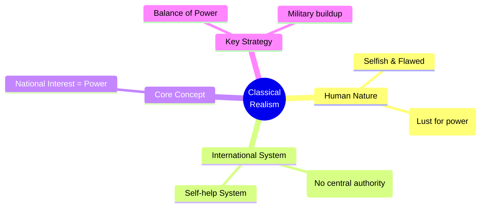

# 📖 Semester 2 | CC-205: Theories of International Relations
## Unit 1: Idealism vs. Realism Debate

---

## 1. Meaning & Evolution of International Relations (अंतर्राष्ट्रीय संबंध)

**English:**
International Relations (IR) is the study of interactions among sovereign states, non-state actors, and international organizations. While international politics has existed since antiquity (e.g., Kautilya's *Mandala Theory*, Thucydides' *Peloponnesian War*), IR emerged as a formal academic discipline in **1919** with the establishment of the Woodrow Wilson Chair at Aberystwyth, Wales, immediately following World War I.

**Hindi (हिंदी व्याख्या):**
अंतर्राष्ट्रीय संबंध (IR) संप्रभु राज्यों, गैर-राज्य अभिनेताओं और अंतर्राष्ट्रीय संगठनों के बीच अंतःक्रियाओं का अध्ययन है। हालाँकि अंतर्राष्ट्रीय राजनीति प्राचीन काल से मौजूद है (जैसे कौटिल्य का *मंडल सिद्धांत*), एक औपचारिक शैक्षणिक विषय के रूप में IR का उदय **1919** में प्रथम विश्व युद्ध के ठीक बाद हुआ था, जिसका उद्देश्य भविष्य में युद्धों को रोकना था।

---

## 2. THE FIRST GREAT DEBATE: Idealism vs. Realism

The foundational debate in IR occurred between the 1920s and 1940s. 

### A. Idealism / Utopianism (आदर्शवाद)
- **Origin:** Rose to prominence after WWI, championed by US President Woodrow Wilson (Fourteen Points).
- **Core Belief:** Human nature is inherently good and rational. War is NOT inevitable; it is a result of bad institutions (like secret diplomacy and arms races).
- **Solution:** Create international organizations (League of Nations), promote international law, disarmament, and collective security.
- **Key Thinkers:** Woodrow Wilson, Immanuel Kant (Perpetual Peace), Norman Angell.

### B. Realism (यथार्थवाद)
- **Origin:** Rose as a critique of Idealism after the failure of the League of Nations and the outbreak of WWII. E.H. Carr called idealists "Utopians."
- **Core Belief:** Human nature is selfish and power-seeking (Hobbesian view). The international system is **anarchic** (there is no world government). Therefore, states must rely on **self-help**.
- **Solution:** Balance of Power, Military deterrence, Alliances.
- **Key Thinkers:** Thucydides, Machiavelli, Thomas Hobbes, E.H. Carr, Hans Morgenthau.

---

## 3. Classical Realism: Hans Morgenthau (हंस मोर्गेंथाऊ)

Hans Morgenthau is the undisputed father of Classical Realism. His masterpiece, ***Politics Among Nations (1948)***, laid out the **Six Principles of Political Realism**:

1. **Objective Laws:** Politics is governed by objective laws rooted in human nature. (मानव स्वभाव पर आधारित वस्तुनिष्ठ नियम)
2. **National Interest defined in terms of Power:** The master key of realism. Statesmen act to maximize power. (राष्ट्रीय हित को शक्ति के रूप में परिभाषित करना)
3. **Interest is dynamic:** The concept of interest remains valid, but its meaning changes depending on the political and cultural context. (हित गतिशील है)
4. **Separation of Moral Command & Political Action:** Universal moral principles cannot be applied to state actions blindly. Survival is the highest morality. (सार्वभौमिक नैतिकता राज्य पर लागू नहीं होती)
5. **No Universal Morality:** The moral aspirations of a particular nation are not the moral laws that govern the universe.
6. **Autonomy of the Political Sphere:** Political realism maintains the autonomy of the political sphere, much like economics or law.

---

## 4. Neo-Realism / Structural Realism (नव-यथार्थवाद)

Proposed by **Kenneth Waltz** in his seminal book ***Theory of International Politics (1979)***.

**How does Neo-Realism differ from Classical Realism?**
- While Morgenthau blamed *human nature* for conflicts, Waltz blamed the *structure* of the international system.
- The structure is **anarchic**. Because there is no 911 to call, states must seek power merely for **security and survival**, not because they are inherently evil.
- **Defensive Realism (Waltz):** States seek *just enough* power to survive.
- **Offensive Realism (John Mearsheimer):** States seek to become the *hegemon* (maximum power) because you can never be sure of another state's intentions.

---

## 5. Exam-Oriented Summary & Revision Notes

### 🧠 Rapid Revision Notes
- **Idealism:** Focuses on 'what ought to be' (Peace, Morality, Institutions). Failed to stop WWII.
- **Realism:** Focuses on 'what is' (Power, Anarchy, Survival).
- **Morgenthau:** Classical Realist; Power is an end in itself.
- **Kenneth Waltz:** Neo-Realist; Power is a means to achieve Security. 

### 💡 Famous Quotes
> *"The strong do what they can and the weak suffer what they must."* — **Thucydides** (Melian Dialogue)
> *"International politics, like all politics, is a struggle for power."* — **Hans Morgenthau**

---

## 6. Question Bank & Model Answers

### A. Very Short Questions (2 Marks)
**Q1. Who wrote the book 'The Twenty Years' Crisis' (1939)?**
*Ans:* E.H. Carr wrote this book, heavily critiquing Idealism and laying the foundation for Realism.

**Q2. What is meant by 'Anarchy' in International Relations?**
*Ans:* Anarchy in IR does not mean chaos; it means the absence of a central, overarching world government to enforce laws on sovereign states.

### B. Long Analytical Questions (12.5 / 15 Marks)
**Q3. Discuss Morgenthau’s six principles of political realism. (UGC NET & M.A. PYQ)**

**Model Answer Outline:**
1. **Introduction:** Define Realism. Introduce Morgenthau and his seminal work *Politics Among Nations (1948)*, which established realism as the dominant paradigm of IR during the Cold War.
2. **The Six Principles:** List and explain each principle clearly.
   - *Law of human nature*
   - *Interest defined as power* (The core principle)
   - *Interest is not fixed*
   - *Tension between moral command and political action* (State survival > Morality)
   - *Rejection of universal moral laws*
   - *Autonomy of the political sphere*
3. **Criticism:** Mention critics like Ann Tickner (Feminist critique: Morgenthau's principles are highly masculine and ignore cooperation) and Neo-realists (who focus on structure rather than human nature).
4. **Modern Relevance:** Explain how the US-China trade war or the Russia-Ukraine conflict perfectly illustrates states acting out of self-interest and power maximization.
5. **Conclusion:** Morgenthau provided the most systematic framework for understanding cold hard political realities, remaining relevant today.

### C. UGC NET Specific MCQs (Paper II)
**Q1. The concept of 'Defensive Realism' is most closely associated with:**
(A) Hans Morgenthau
(B) John Mearsheimer
(C) Kenneth Waltz
(D) Woodrow Wilson
*Answer:* (C) Kenneth Waltz

**Q2. Which of the following is NOT one of Morgenthau’s principles of political realism?**
(A) Politics is governed by objective laws with roots in human nature.
(B) National interest is defined in terms of power.
(C) Universal moral principles apply strictly to state behavior.
(D) The political sphere is autonomous.
*Answer:* (C) Universal moral principles apply strictly to state behavior. (He explicitly rejected this).

---

---

## 8. Phase 12 Mega Expansion: 20 High-Yield Questions

### Top 10 Short Questions (2-5 Marks)
**Q1. What is the central theme of 'Classical Realism'?**
*Ans:* Human nature is inherently selfish and power-seeking. Therefore, international politics is a continuous struggle for power among states, driven by human nature.

**Q2. Differentiate between Classical Realism and Neo-Realism.**
*Ans:* Classical Realism (Morgenthau) blames human nature for state conflict. Neo-Realism/Structural Realism (Waltz) blames the anarchic structure of the international system for state behavior.

**Q3. What is the 'Security Dilemma'?**
*Ans:* A situation where one state's efforts to increase its security (e.g., building arms) inadvertently makes other states feel less secure, leading them to do the same, causing an arms race.

**Q4. Define 'Complex Interdependence' in Liberal theory.**
*Ans:* Formulated by Keohane and Nye. It posits that states are connected through multiple channels (not just state-to-state), security is not always the primary issue, and military force is less effective.

**Q5. What is the 'Democratic Peace Theory'?**
*Ans:* The liberal proposition (originating from Kant) that democracies are hesitant to engage in armed conflict with other identified democracies.

**Q6. What does 'Constructivism' argue in IR?**
*Ans:* Introduced by Alexander Wendt, it argues that international reality is socially constructed by ideas, identities, and norms, not just material forces. "Anarchy is what states make of it."

**Q7. Explain the 'Dependency Theory'.**
*Ans:* A Marxist/Structuralist theory arguing that resources flow from a "periphery" of poor, underdeveloped states to a "core" of wealthy states, enriching the latter at the expense of the former.

**Q8. What is 'Soft Power'?**
*Ans:* Coined by Joseph Nye. It is the ability of a country to persuade others to do what it wants without force or coercion, typically through culture, political values, and foreign policies.

**Q9. Define 'Balance of Power'.**
*Ans:* A policy where states act (e.g., through alliances) to prevent any one state from developing enough military power to dominate the others.

**Q10. What is 'Collective Security'?**
*Ans:* A security arrangement (like the UN) where states agree that a security threat to one is a threat to all, and commit to join in a collective response against an aggressor.

---

### Top 10 Long Analytical Questions (15-20 Marks)
**Q1. Critically examine Hans Morgenthau’s Six Principles of Political Realism.**
*Outline:* Intro -> Six principles (Objective laws of human nature, National interest defined in power, Interest is dynamic, Tension between moral command and political action, Rejection of universal moral laws, Autonomy of political sphere) -> Feminist critique (Tickner) -> Conclusion.

**Q2. Discuss Kenneth Waltz's Neo-Realism and how it differs from Classical Realism.**
*Outline:* Intro -> Structural determinism -> Anarchy -> Defensive Realism -> States as "billiard balls" seeking survival, not absolute power -> Conclusion.

**Q3. Evaluate the relevance of Liberalism/Idealism in modern International Relations.**
*Outline:* Intro (Woodrow Wilson's 14 Points) -> Core tenets (Faith in human reason, progress, harmony of interests) -> Neo-Liberal Institutionalism (Keohane) -> Democratic Peace Theory -> Interdependence -> Conclusion.

**Q4. Critically analyze the Marxist/Structuralist approach to International Relations (Dependency and World-Systems Theory).**
*Outline:* Intro -> Rejection of state-centric views; focus on economic classes/capitalism -> Dependency Theory (Frank, Prebisch) -> World-Systems Theory (Wallerstein: Core, Periphery, Semi-periphery) -> Conclusion.

**Q5. "Anarchy is what states make of it." Evaluate this statement in the context of Constructivism.**
*Outline:* Intro (Alexander Wendt) -> Rejection of material determinism -> Role of ideas, norms, and identities -> Hobbesian, Lockean, and Kantian cultures of anarchy -> Conclusion.

**Q6. Discuss the Feminist critique of traditional International Relations theories.**
*Outline:* Intro (J. Ann Tickner, Cynthia Enloe) -> Traditional IR is heavily masculinized (focus on power, war, rationality) -> "Where are the women?" -> Re-defining security (human security vs state security) -> Conclusion.

**Q7. Analyze the concept of National Power and discuss its various elements.**
*Outline:* Intro -> Definition of Power (Capacity to influence) -> Tangible elements (Geography, Resources, Population, Military) -> Intangible elements (Leadership, Morale, Ideology, Diplomacy) -> Soft vs Hard power -> Conclusion.

**Q8. Evaluate 'Balance of Power' and 'Collective Security' as methods of managing power.**
*Outline:* Intro -> Balance of Power mechanisms (Alliances, Armaments, Buffer states) -> Collective Security mechanism (UN Charter Chapter VII) -> Differences (BoP assumes enemies exist; CS assumes all will unite against any aggressor) -> Conclusion.

**Q9. Discuss the relevance of the Non-Aligned Movement (NAM) in the post-Cold War era.**
*Outline:* Intro (Cold War context, Bandung) -> Principles (Panchsheel) -> Relevance today (North-South divide, neo-colonialism, WTO/climate negotiations, voice of Global South) -> Conclusion.

**Q10. Critically examine the concept of 'National Interest'. Is it static or dynamic?**
*Outline:* Intro -> Definition (Goals a state pursues in foreign policy) -> Core/Vital interests (Survival) vs Variable/Secondary interests -> Realist vs Constructivist view of National Interest -> Conclusion.

---

> [!IMPORTANT]
> ### 🎓 UGC NET Expert Tips for International Relations
> 1. **Morgenthau vs Tickner:** NTA frequently asks about J. Ann Tickner's feminist reformulation of Morgenthau's 6 principles. Know that she introduces "cooperation" and "mutuality" into realism.
> 2. **Offensive vs Defensive Realism:** Know the difference! Defensive Realism = Kenneth Waltz (States seek security/survival). Offensive Realism = John Mearsheimer (States seek hegemony, they are power maximizers).
> 3. **Theories and Thinkers:** Match exactly: Structuralism -> Wallerstein. Constructivism -> Alexander Wendt. Complex Interdependence -> Keohane & Nye. Soft Power -> Joseph Nye.
> 4. **Books to Memorize:** *Theory of International Politics* (Waltz, 1979); *The Tragedy of Great Power Politics* (Mearsheimer, 2001); *Social Theory of International Politics* (Wendt, 1999).

---
*Created as part of the BBMKU M.A. Political Science & UGC NET Master Dashboard Project.*
