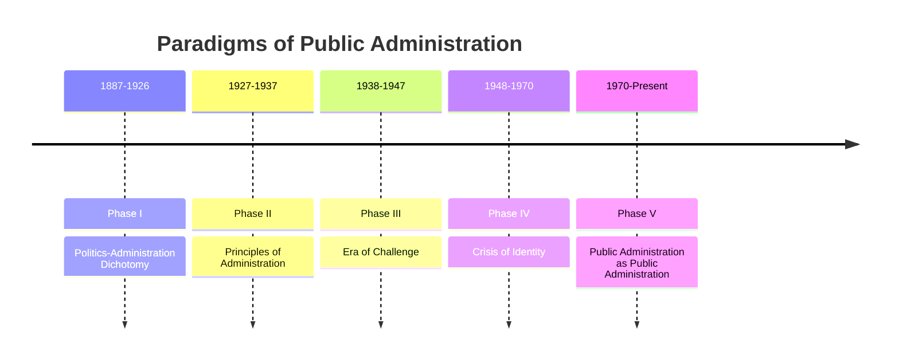

# 📖 Semester 2 | CC-206: Public Administration
## Unit 1: Meaning, Nature, Scope, and Evolution

---

## 1. Meaning & Definition (अर्थ एवं परिभाषा)

**English:**
Public Administration is the detailed and systematic execution of public law. It is the action part of government, the means by which the purposes and goals of government are realized. If Politics is about *making* policies, Public Administration is about *implementing* them.

**Hindi (हिंदी व्याख्या):**
लोक प्रशासन सार्वजनिक कानून का विस्तृत और व्यवस्थित क्रियान्वयन है। यह सरकार का 'कार्यशील' हिस्सा है, वह साधन जिसके द्वारा सरकार के उद्देश्यों और लक्ष्यों को प्राप्त किया जाता है। यदि राजनीति नीतियां *बनाने* के बारे में है, तो लोक प्रशासन उन्हें *लागू करने* के बारे में है।

| Scholar | Definition | Key Concept |
| :--- | :--- | :--- |
| **Woodrow Wilson** | "Public administration is detailed and systematic execution of public law. Every particular application of general law is an act of administration." | Execution of Law |
| **L.D. White** | "Public Administration consists of all those operations having for their purpose the fulfillment or enforcement of public policy." | Public Policy |

---

## 2. Evolution of Public Administration (विकास के चरण)

The discipline evolved through five distinct paradigms (phases), famously conceptualized by Nicholas Henry.

### Phase I (1887-1926): Politics-Administration Dichotomy
- Began with **Woodrow Wilson's** essay *"The Study of Administration" (1887)*. Wilson is known as the Father of Public Administration.
- **Core Idea:** Politics (policymaking) and Administration (policy execution) are two separate spheres. Administration should run like a business, free from political interference.
- **Key Book:** Frank Goodnow's *Politics and Administration (1900)*.

### Phase II (1927-1937): Principles of Administration
- **Core Idea:** Administration is a science with universal principles applicable to all organizations (public or private).
- **Key Thinkers:** F.W. Taylor (Scientific Management), Henri Fayol, Luther Gulick & Lyndall Urwick (POSDCORB).

### Phase III (1938-1947): Era of Challenge
- **Core Idea:** Thinkers challenged the 'dichotomy' and the 'principles'. 
- **Herbert Simon** famously dismissed the universal principles (like POSDCORB) as mere "Proverbs" (कहावतें). He introduced the **Decision-Making** approach.
- **Robert Dahl** argued that Public Admin cannot be a true science until it incorporates human behavior and comparative studies.

---

## 3. New Public Administration (NPA) - नव लोक प्रशासन

By the late 1960s, traditional public administration was failing to solve severe social problems in the USA (civil rights riots, Vietnam war protests, poverty). It was too obsessed with 'efficiency' and 'economy' while ignoring social equity.

### The Minnowbrook Conference I (1968)
Organized by **Dwight Waldo** at Syracuse University, this conference birthed New Public Administration (NPA). 

**4 Goals/Themes of NPA (NPA के 4 मुख्य लक्ष्य):**
1. **Relevance (प्रासंगिकता):** Administration must address real-world social problems.
2. **Values (मूल्य):** Rejected value-free, neutral administration. Administrators must actively champion the cause of the poor and marginalized.
3. **Social Equity (सामाजिक समानता):** The primary goal of NPA. Delivering public services fairly to bridge the gap between rich and poor.
4. **Change (परिवर्तन):** Must challenge the status quo and adapt to changing social environments.

---

## 4. Nature of Public Administration (प्रकृति)

There are two major views regarding the nature of Public Administration:
1. **Integral View (समग्र दृष्टिकोण):** Public Administration includes *all* activities (manual, clerical, managerial, and technical) undertaken to fulfill public policy. (Supported by L.D. White, Woodrow Wilson).
2. **Managerial View (प्रबंधकीय दृष्टिकोण):** Public Administration only includes the managerial activities of the top executives (Planning, Organizing, Controlling). Clerical and manual work is excluded. (Supported by Luther Gulick, Herbert Simon).

---

## 5. Exam-Oriented Summary & Revision Notes

### 🧠 Rapid Revision Notes
- **Woodrow Wilson:** Father of Public Administration (1887 essay).
- **POSDCORB:** Coined by Luther Gulick. Stands for **P**lanning, **O**rganizing, **S**taffing, **D**irecting, **CO**-ordinating, **R**eporting, **B**udgeting.
- **Herbert Simon:** Called administrative principles "proverbs" and focused on Decision-Making and "Bounded Rationality."
- **NPA (1968):** Shifted focus from *efficiency* to *social equity*. Led by Dwight Waldo.

### 💡 Memory Tricks / Mnemonics
> **Goals of NPA Mnemonic:** **RVSC** (Reserve)
> **R**elevance, **V**alues, **S**ocial Equity, **C**hange.

---

## 6. Question Bank & Model Answers

### A. Very Short Questions (2 Marks)
**Q1. What does POSDCORB stand for?**
*Ans:* POSDCORB stands for Planning, Organizing, Staffing, Directing, Co-ordinating, Reporting, and Budgeting. It outlines the key functions of an executive.

**Q2. Who called the classical principles of administration "proverbs"?**
*Ans:* Herbert Simon called them proverbs because for every principle, there was a contradictory principle.

### B. Long Analytical Questions (12.5 / 15 Marks)
**Q3. Discuss the evolution of New Public Administration (NPA) and highlight its key themes. (UGC NET & M.A. PYQ)**

**Model Answer Outline:**
1. **Introduction:** Define Public Admin. Mention that by the 1960s, traditional PA was facing a crisis because its obsession with "efficiency" and "economy" ignored growing social unrest (civil rights, poverty).
2. **Minnowbrook I (1968):** Explain how young scholars led by Dwight Waldo gathered at Minnowbrook to redefine the discipline, officially launching NPA.
3. **Core Themes (RVSC):**
   - *Relevance:* Must solve current social issues.
   - *Values:* Reject value-neutrality; bureaucrats must be committed to social justice.
   - *Social Equity:* The crowning jewel of NPA. Resources must be directed to the most disadvantaged sections.
   - *Change/Innovation:* Bureaucracies must become flexible, client-oriented, and less hierarchical.
4. **Impact:** NPA brought ethics and humanism back into administration, contrasting sharply with the machine-like Scientific Management theory of Taylor.
5. **Conclusion:** NPA shifted the focus of government from "doing things cheaply" to "doing things fairly."

### C. UGC NET Specific MCQs (Paper II)
**Q1. The essay "The Study of Administration", which marked the birth of Public Administration as a separate discipline, was written by:**
(A) L.D. White
(B) Frank Goodnow
(C) Woodrow Wilson
(D) Max Weber
*Answer:* (C) Woodrow Wilson

**Q2. The first Minnowbrook Conference was held in which year?**
(A) 1968
(B) 1978
(C) 1988
(D) 1998
*Answer:* (A) 1968

**Q3. Who among the following is the chief architect of the 'Decision-Making' approach in Public Administration?**
(A) Elton Mayo
(B) Herbert Simon
(C) F.W. Taylor
(D) Chris Argyris
*Answer:* (B) Herbert Simon

---

---

## 8. Phase 12 Mega Expansion: 20 High-Yield Questions

### Top 10 Short Questions (2-5 Marks)
**Q1. What is the difference between Public Administration and Private Administration?**
*Ans:* Public administration focuses on public welfare, is subject to strict political/public accountability, and provides monopolies. Private administration focuses on profit, flexibility, and market competition.

**Q2. Define 'New Public Administration' (NPA).**
*Ans:* Emerged from the Minnowbrook Conference (1968). It rejected value-neutrality and focused on Relevance, Values, Social Equity, and Change in public administration.

**Q3. What is Taylor’s 'Scientific Management'?**
*Ans:* A theory focused on maximizing industrial efficiency through time-and-motion studies, standardization of tools, and the piece-rate wage system. It treats workers as "economic men".

**Q4. Explain the 'Hawthorne Effect'.**
*Ans:* Derived from Elton Mayo’s experiments (1924-1932). It refers to the phenomenon where workers improve their productivity simply because they know they are being observed and feel valued by management.

**Q5. What is 'Bounded Rationality' by Herbert Simon?**
*Ans:* The idea that decision-makers in administration do not have access to complete information, time, or cognitive ability. Therefore, they make 'satisficing' (satisfactory and sufficient) decisions rather than optimal ones.

**Q6. Define Max Weber’s concept of 'Legal-Rational Authority'.**
*Ans:* Authority based on a system of clear, formal rules and laws. It is the basis of modern ideal-type bureaucracy where obedience is owed to the legally established impersonal order, not a specific person.

**Q7. What is the 'Prismatic-Sala Model'?**
*Ans:* F.W. Riggs’ ecological model to study administration in developing countries. 'Prismatic' societies are in transition between 'Fused' (traditional) and 'Diffracted' (modern) societies. 'Sala' is the administrative sub-system of a prismatic society.

**Q8. Differentiate between Line, Staff, and Auxiliary agencies.**
*Ans:* Line agencies perform primary operational functions (e.g., Police). Staff agencies advise and plan (e.g., NITI Aayog). Auxiliary agencies provide common housekeeping services (e.g., Public Works Dept).

**Q9. What is 'New Public Management' (NPM)?**
*Ans:* Emerged in the 1990s (Osborne & Gaebler's *Reinventing Government*). It advocates applying private-sector management techniques to government (e.g., privatization, performance targets, customer focus).

**Q10. Define 'Zero-Based Budgeting' (ZBB).**
*Ans:* A budgeting method where every department function must be reviewed and justified from 'zero' base every year, rather than just adjusting the previous year's budget.

---

### Top 10 Long Analytical Questions (15-20 Marks)
**Q1. Discuss the evolution of Public Administration as an academic discipline from Woodrow Wilson to the present.**
*Outline:* Intro -> 5 Paradigms (Politics-Administration Dichotomy, Principles of Admin, Era of Challenge, Crisis of Identity, Public Admin as Public Admin) -> Current focus on Governance and NPM -> Conclusion.

**Q2. Critically examine the Human Relations Theory of Elton Mayo.**
*Outline:* Intro -> Context (Reaction to Taylor) -> Hawthorne Experiments (Illumination, Relay Assembly, Bank Wiring) -> Findings (Informal groups, social/psychological factors) -> Criticism (Pro-management bias) -> Conclusion.

**Q3. Evaluate Herbert Simon's Decision-Making approach in Public Administration.**
*Outline:* Intro -> Critique of classical 'proverbs' of admin -> Fact-Value dichotomy -> Concept of Bounded Rationality -> 'Economic man' vs 'Administrative man' (Satisficing) -> Conclusion.

**Q4. Discuss Max Weber’s ideal type of Bureaucracy. What are its major criticisms?**
*Outline:* Intro -> Three types of authority (Traditional, Charismatic, Legal-Rational) -> Characteristics of ideal bureaucracy (Hierarchy, rules, impersonality) -> Criticisms (Merton: Red tape/Goal displacement, Peter Principle) -> Conclusion.

**Q5. Analyze the Ecological Approach to Public Administration with reference to F.W. Riggs.**
*Outline:* Intro -> Definition of ecological approach -> Fused-Prismatic-Diffracted model -> Features of Prismatic society (Heterogeneity, Formalism, Overlapping) -> The Sala model (Nepotism, poly-communalism) -> Conclusion.

**Q6. Evaluate the concept and features of New Public Administration (NPA).**
*Outline:* Intro -> Context (1960s USA, Minnowbrook I) -> Key thinkers (Dwight Waldo, George Frederickson) -> Four pillars (Relevance, Values, Equity, Change) -> Impact on modern administration -> Conclusion.

**Q7. Discuss the various models of Public Policy Formulation.**
*Outline:* Intro -> Definition of Public Policy (Thomas Dye) -> Models (Institutional, Systems/Easton, Elite-Mass, Group theory, Incremental/Lindblom, Rational-Comprehensive) -> Conclusion.

**Q8. Examine the role and functions of the Chief Executive in modern administration.**
*Outline:* Intro -> Types (Parliamentary vs Presidential) -> Functions (POSDCORB by Luther Gulick: Planning, Organizing, Staffing, Directing, Coordinating, Reporting, Budgeting) -> Conclusion.

**Q9. Discuss the concept of 'Good Governance' as promoted by the World Bank.**
*Outline:* Intro -> 1989 World Bank report on Sub-Saharan Africa -> 8 characteristics (Participatory, Consensus oriented, Accountable, Transparent, Responsive, Effective, Equitable, Rule of law) -> Conclusion.

**Q10. Analyze the mechanisms of Financial Control over administration in India.**
*Outline:* Intro -> Need for financial accountability -> Legislative control (Budget enactment, Committees like PAC and Estimates Committee) -> Executive control (Ministry of Finance) -> Audit control (CAG) -> Conclusion.

---

> [!IMPORTANT]
> ### 🎓 UGC NET Expert Tips for Public Administration
> 1. **Chronology of Conferences:** Minnowbrook I (1968, NPA), Minnowbrook II (1988), Minnowbrook III (2008). 
> 2. **Books to Memorize:** *The Study of Administration* (Wilson, 1887); *Administrative Behavior* (Simon, 1947); *Ecology of Public Administration* (Riggs, 1961); *Reinventing Government* (Osborne & Gaebler, 1992).
> 3. **Theories and Fathers:** Scientific Management = F.W. Taylor. Human Relations = Elton Mayo. Decision-Making = Herbert Simon. Ecological = F.W. Riggs.
> 4. **Keywords:** If you see "Satisficing" -> Simon. If you see "Formalism/Overlapping" -> Riggs. If you see "POSDCORB" -> Gulick. If you see "Social Equity" -> NPA.

---
*Created as part of the BBMKU M.A. Political Science & UGC NET Master Dashboard Project.*
