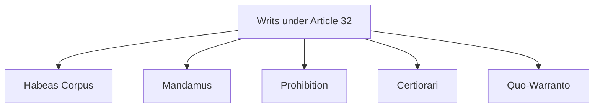

# 📖 Semester 2 | CC-207: Indian Political System
## Unit 1: The Constitution & Fundamental Rights

---

## 1. The Making of the Constitution (संविधान का निर्माण)

**English:**
The Constitution of India was drafted by the Constituent Assembly, which was set up under the **Cabinet Mission Plan of 1946**. It took precisely **2 years, 11 months, and 18 days** to complete. It was adopted on November 26, 1949, and came into force on January 26, 1950. It is the longest written national constitution in the world.

**Hindi (हिंदी व्याख्या):**
भारत का संविधान संविधान सभा द्वारा तैयार किया गया था, जिसका गठन **1946 की कैबिनेट मिशन योजना** के तहत किया गया था। इसे पूरा होने में ठीक **2 साल, 11 महीने और 18 दिन** लगे। इसे 26 नवंबर 1949 को अपनाया गया और 26 जनवरी 1950 को लागू किया गया। यह दुनिया का सबसे लंबा लिखित राष्ट्रीय संविधान है।

### Key Committees & Chairmen
- **Drafting Committee:** Dr. B.R. Ambedkar (Father of the Indian Constitution)
- **Union Powers Committee:** Jawaharlal Nehru
- **Provincial Constitution Committee:** Sardar Vallabhbhai Patel
- **Fundamental Rights Sub-Committee:** J.B. Kripalani

---

## 2. Fundamental Rights (मौलिक अधिकार) - Part III, Articles 12-35

Fundamental rights are justiciable rights enshrined in Part III of the Constitution. They protect citizens against arbitrary state action. They are inspired by the US *Bill of Rights*.

### The Six Fundamental Rights (वर्तमान में 6 मौलिक अधिकार)
1. **Right to Equality (समानता का अधिकार) [Art 14 - 18]**
2. **Right to Freedom (स्वतंत्रता का अधिकार) [Art 19 - 22]**
3. **Right against Exploitation (शोषण के विरुद्ध अधिकार) [Art 23 - 24]**
4. **Right to Freedom of Religion (धार्मिक स्वतंत्रता का अधिकार) [Art 25 - 28]**
5. **Cultural and Educational Rights (सांस्कृतिक और शैक्षिक अधिकार) [Art 29 - 30]**
6. **Right to Constitutional Remedies (संवैधानिक उपचारों का अधिकार) [Art 32]**

*(Note: The Right to Property, Article 31, was removed from the list of Fundamental Rights by the 44th Amendment in 1978 and made a legal right under Article 300A).*

---

## 3. Article 32: The Heart and Soul of the Constitution

Dr. B.R. Ambedkar famously called **Article 32** (Right to Constitutional Remedies) the "heart and soul" of the Constitution because it allows a citizen to directly approach the Supreme Court if their fundamental rights are violated.

The Supreme Court issues **5 Types of Writs (रिट)** under Art 32:

| Writ | Literal Meaning | Purpose |
| :--- | :--- | :--- |
| **Habeas Corpus** | "To have the body of" | To release a person unlawfully detained. |
| **Mandamus** | "We Command" | To order a public official to perform their legal duty. |
| **Prohibition** | "To forbid" | To stop a lower court from exceeding its jurisdiction. |
| **Certiorari** | "To be certified" | To quash the order of a lower court. |
| **Quo-Warranto** | "By what authority?" | To prevent a person from illegally holding a public office. |

---

## 4. Fundamental Rights vs. Directive Principles (DPSP)

While Part III contains Fundamental Rights (FRs), Part IV (Art 36-51) contains Directive Principles of State Policy (DPSP).

| Feature | Fundamental Rights (FRs) | Directive Principles (DPSP) |
| :--- | :--- | :--- |
| **Nature** | Negative (Restricts state action) | Positive (Instructs state to do something) |
| **Justiciability** | Justiciable (Enforceable by courts) | Non-Justiciable (Cannot be enforced by courts) |
| **Goal** | Establish Political Democracy | Establish Social & Economic Democracy |
| **Origin** | USA | Ireland |

### Landmark Supreme Court Judgements (Landmark Cases)
1. **Golaknath Case (1967):** Supreme Court ruled that Parliament cannot amend Fundamental Rights.
2. **Kesavananda Bharati Case (1973):** Established the **"Basic Structure Doctrine"** (मूल ढांचा सिद्धांत). Parliament can amend any part of the Constitution, including FRs, *except* the basic structure.
3. **Minerva Mills Case (1980):** Struck a balance between FRs and DPSP, stating the constitution rests on the bedrock of balance between the two.

---

## 5. Exam-Oriented Summary & Revision Notes

### 🧠 Rapid Revision Notes
- **Constituent Assembly:** Set up by Cabinet Mission (1946).
- **Drafting Committee:** Chaired by Dr. Ambedkar.
- **Article 17:** Abolition of Untouchability.
- **Article 21:** Right to Life and Personal Liberty (expanded to include right to privacy, clean environment, etc.)
- **Article 32:** Heart and Soul (Constitutional Remedies).
- **Basic Structure Doctrine:** Established in the Kesavananda Bharati case (1973).

### 💡 Memory Tricks / Mnemonics
> **Writs Mnemonic:** **HMP-CQ** 
> **H**abeas Corpus, **M**andamus, **P**rohibition, **C**ertiorari, **Q**uo-Warranto.

---

## 6. Question Bank & Model Answers

### A. Very Short Questions (2 Marks)
**Q1. Which amendment removed the Right to Property from the list of Fundamental Rights?**
*Ans:* The 44th Constitutional Amendment Act of 1978 removed it, making it a legal right under Article 300A.

**Q2. What is the literal meaning of 'Mandamus'?**
*Ans:* Mandamus literally means "We Command." It is issued by a court directing a public official to perform their official duties.

### B. Long Analytical Questions (12.5 / 15 Marks)
**Q3. Discuss the significance of Article 32 in the Indian Constitution. Explain the various writs issued under it. (BBMKU PYQ)**

**Model Answer Outline:**
1. **Introduction:** Define Article 32 (Right to Constitutional Remedies). Quote Dr. B.R. Ambedkar calling it the "heart and soul" of the Constitution.
2. **Significance:** A right without a remedy is useless. Article 32 makes Fundamental Rights real by providing a guaranteed, quick mechanism for enforcement directly via the Supreme Court.
3. **The 5 Writs:** Explain each writ in detail:
   - *Habeas Corpus:* Protection against illegal arrest.
   - *Mandamus:* Command to perform public duty.
   - *Prohibition:* Prevent lower court overreach.
   - *Certiorari:* Quash illegal orders of lower courts.
   - *Quo-Warranto:* Prevent illegal usurpation of public office.
4. **Comparison with Article 226:** Mention that High Courts can also issue writs under Art 226, and their writ jurisdiction is actually *wider* than the Supreme Court's because they can issue writs for legal rights too.
5. **Conclusion:** Summarize that Article 32 is the ultimate protector of democracy and citizen liberty in India.

### C. UGC NET Specific MCQs (Paper II)
**Q1. In which landmark case did the Supreme Court of India propound the 'Basic Structure Doctrine'?**
(A) A.K. Gopalan Case (1950)
(B) Golaknath Case (1967)
(C) Kesavananda Bharati Case (1973)
(D) S.R. Bommai Case (1994)
*Answer:* (C) Kesavananda Bharati Case (1973)

**Q2. Which of the following writs translates to "by what authority"?**
(A) Certiorari
(B) Quo-Warranto
(C) Mandamus
(D) Prohibition
*Answer:* (B) Quo-Warranto

**Q3. The Directive Principles of State Policy (DPSP) are borrowed from the constitution of which country?**
(A) USA
(B) Ireland
(C) USSR
(D) Canada
*Answer:* (B) Ireland

---

---

## 8. Phase 12 Mega Expansion: 20 High-Yield Questions

### Top 10 Short Questions (2-5 Marks)
**Q1. What is the 'Basic Structure Doctrine'?**
*Ans:* Propounded in the Kesavananda Bharati case (1973). It states that Parliament can amend any part of the Constitution, but it cannot alter or destroy its "basic structure" (e.g., secularism, democracy, judicial review).

**Q2. Define 'Judicial Activism'.**
*Ans:* A proactive role played by the judiciary in protecting citizens' rights and promoting justice, sometimes intervening in the domain of the executive/legislature (e.g., PILs).

**Q3. What are the 5 types of Writs under Article 32?**
*Ans:* Habeas Corpus (to produce the body), Mandamus (we command), Prohibition (to forbid a lower court), Certiorari (to be certified/quash order), Quo-Warranto (by what authority).

**Q4. Explain the difference between Fundamental Rights (FRs) and DPSP.**
*Ans:* FRs (Part III) are political rights and are justiciable (enforceable in courts). DPSP (Part IV) are socio-economic goals and are non-justiciable.

**Q5. What is 'Asymmetric Federalism' in India?**
*Ans:* A system where some states enjoy special status and powers compared to others to accommodate diversity (e.g., Article 371 provisions for North-Eastern states and formerly Article 370 for J&K).

**Q6. Define 'Secularism' in the Indian context.**
*Ans:* Unlike Western negative secularism (strict separation of state and religion), Indian positive secularism means *Sarva Dharma Sambhava* (the state treats all religions with equal respect and maintains principled distance).

**Q7. What is the role of the Governor according to the Sarkaria Commission?**
*Ans:* The Sarkaria Commission recommended that the Governor should be an eminent person from outside the state, not intimately connected with local politics, to ensure neutrality.

**Q8. Explain the Anti-Defection Law.**
*Ans:* Added by the 52nd Amendment (1985) in the 10th Schedule. It disqualifies MPs/MLAs who voluntarily give up their party membership or vote against party whips, to curb the "Aaya Ram, Gaya Ram" politics.

**Q9. What are the three tiers of the Panchayati Raj System?**
*Ans:* Established by the 73rd Amendment (1992): Gram Panchayat (Village level), Panchayat Samiti (Block level), and Zila Parishad (District level).

**Q10. Define 'Coalition Government'.**
*Ans:* A cabinet formed by multiple political parties when no single party achieves an absolute majority in the legislature. It requires compromise and a Common Minimum Programme.

---

### Top 10 Long Analytical Questions (15-20 Marks)
**Q1. "The Indian Constitution is federal in form but unitary in spirit." Discuss this statement.**
*Outline:* Intro -> Federal features (Division of powers, Bicameralism, Written Constitution) -> Unitary features (Single citizenship, Emergency powers, All India Services, Appointment of Governors) -> K.C. Wheare's "Quasi-federal" view -> Conclusion.

**Q2. Critically examine the philosophy enshrined in the Preamble of the Indian Constitution.**
*Outline:* Intro -> Source of authority (We the people) -> Nature of state (Sovereign, Socialist, Secular, Democratic, Republic) -> Objectives (Justice, Liberty, Equality, Fraternity) -> Is it part of the Constitution? (Berubari vs. Kesavananda) -> Conclusion.

**Q3. Discuss the Fundamental Rights guaranteed under Part III of the Constitution. Are they absolute?**
*Outline:* Intro -> 6 categories of rights -> Focus on Art 19 (Freedoms) and Art 21 (Life and Liberty) -> Reasonable restrictions (Security of state, public order, decency) -> Suspension during emergency -> Conclusion.

**Q4. Evaluate the relationship between Fundamental Rights and Directive Principles of State Policy.**
*Outline:* Intro -> FRs (Political democracy) vs DPSP (Socio-economic democracy) -> Evolution of the conflict (Champakam Dorairajan -> Golaknath -> Kesavananda -> Minerva Mills) -> The current doctrine of "Harmonious Construction" -> Conclusion.

**Q5. Analyze the role and powers of the President of India. Is the President merely a rubber stamp?**
*Outline:* Intro -> Executive, Legislative, Financial, Judicial powers -> Veto powers (Pocket veto) -> Situational discretion (Hung parliament, Caretaker govt) -> 42nd and 44th Amendments -> Conclusion (Constitutional head, not just rubber stamp).

**Q6. Discuss the composition, powers, and role of the Supreme Court of India.**
*Outline:* Intro -> Integrated judiciary -> Jurisdictions (Original, Appellate, Advisory - Art 143, Writ - Art 32) -> Judicial Review and Basic Structure -> Judicial Activism -> Conclusion.

**Q7. Examine the changing nature of the Party System in India.**
*Outline:* Intro -> One-Party Dominant system (Congress System 1952-1967) -> Multi-party coalition era (1989-2014) -> Return to dominant party system (Post-2014) -> Regionalization of politics -> Conclusion.

**Q8. Evaluate the impact of the 73rd and 74th Constitutional Amendment Acts on democratic decentralization in India.**
*Outline:* Intro -> Balwant Rai Mehta committee -> 73rd (Panchayats) & 74th (Municipalities) provisions (3-tier system, SEC, SFC, 33% women reservation) -> Successes (Empowerment) -> Failures (Lack of funds, functions, functionaries) -> Conclusion.

**Q9. Discuss the role of Caste and Religion in Indian Electoral Politics.**
*Outline:* Intro -> Politicization of caste (Rajni Kothari's view) -> Vote bank politics -> Role of religion and communalism -> Impact on governance and secularism -> Conclusion.

**Q10. Analyze the major tension areas in Centre-State relations in India.**
*Outline:* Intro -> Legislative, Executive, Financial relations -> Tension areas (Role of Governor - Art 155, President's Rule - Art 356, Financial dependence, Deployment of Central forces) -> Recommendations of Sarkaria and Punchhi Commissions -> Conclusion.

---

> [!IMPORTANT]
> ### 🎓 UGC NET Expert Tips for Indian Political System
> 1. **Important Cases:** Kesavananda Bharati (1973 - Basic Structure), Minerva Mills (1980 - Balance between FR & DPSP), S.R. Bommai (1994 - Federalism & Art 356), Maneka Gandhi (1978 - Due process in Art 21).
> 2. **Committees to remember:** Punchayati Raj (Balwant Rai Mehta, Ashok Mehta). Centre-State (Sarkaria, Punchhi, Rajamannar). Fundamental Duties (Swaran Singh).
> 3. **Constitutional Amendments:** 42nd (Mini Constitution), 44th (Right to Property removed), 52nd (Anti-Defection), 61st (Voting age 21 to 18), 73rd/74th (Local self-govt), 86th (Right to Education).
> 4. **Articles:** Memorize exact Articles for President (52-62), Supreme Court (124-147), Finance Commission (280), Election Commission (324), Emergency (352, 356, 360).

---
*Created as part of the BBMKU M.A. Political Science & UGC NET Master Dashboard Project.*
