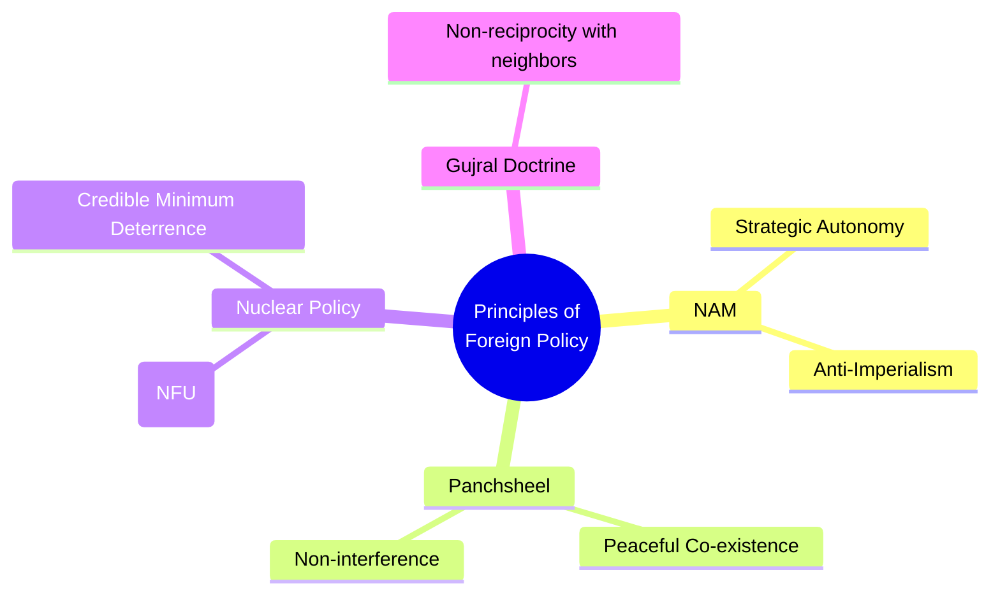

# 📖 Semester 3 | CC-308: India's Foreign Policy
## Unit 1: Determinants, Evolution, and Basic Principles

---

## 1. Meaning & Objectives (अर्थ एवं उद्देश्य)

**English:**
Foreign Policy refers to a state's strategy and tactics in dealing with other nations to safeguard its national interests. The primary objective of India's foreign policy is to protect its territorial integrity, ensure national security, promote economic development, and maintain strategic autonomy in global affairs.

**Hindi (हिंदी व्याख्या):**
विदेश नीति से तात्पर्य किसी राज्य की उस रणनीति और रणनीति से है जो वह अपने राष्ट्रीय हितों की रक्षा के लिए अन्य देशों के साथ व्यवहार करते समय अपनाता है। भारत की विदेश नीति का प्राथमिक उद्देश्य अपनी क्षेत्रीय अखंडता की रक्षा करना, राष्ट्रीय सुरक्षा सुनिश्चित करना, आर्थिक विकास को बढ़ावा देना और वैश्विक मामलों में रणनीतिक स्वायत्तता बनाए रखना है।

---

## 2. Determinants of India's Foreign Policy (निर्धारक तत्व)

The foreign policy of India is shaped by various domestic and international factors:

1. **Geography (भूगोल):** India’s vast coastline, the Himalayan barrier in the North, and hostile neighbors (Pakistan and China) heavily dictate its security policies. K.M. Panikkar emphasized the importance of the Indian Ocean.
2. **History & Culture (इतिहास और संस्कृति):** India's legacy of the anti-colonial struggle, teachings of Buddha/Gandhi (non-violence, peace), and Vasudhaiva Kutumbakam (The World is One Family) shape its soft power.
3. **Economy (अर्थव्यवस्था):** The need for FDI, technology, and energy security (oil from the Middle East) drives modern economic diplomacy.
4. **Domestic Politics (घरेलू राजनीति):** Coalition politics and regional interests often influence foreign policy (e.g., Tamil Nadu's influence on Sri Lanka policy, West Bengal on Bangladesh).
5. **Leadership (नेतृत्व):** The personal worldview of Prime Ministers (Nehru's idealism vs. Modi's pragmatic realism) plays a crucial role.

---

## 3. Basic Principles of India's Foreign Policy (मूल सिद्धांत)

### A. Non-Alignment Movement (NAM - गुटनिरपेक्ष आंदोलन)
- **Origin:** Born during the Cold War. Formally established in **1961 at Belgrade**.
- **Founding Fathers:** Nehru (India), Tito (Yugoslavia), Nasser (Egypt), Sukarno (Indonesia), Nkrumah (Ghana).
- **Core Concept:** It does NOT mean neutrality or isolationism. It means **Strategic Autonomy**—the right to judge every international issue on its own merit rather than blindly following the US or USSR blocs.

### B. Panchsheel (पंचशील - The Five Principles of Peaceful Coexistence)
Signed between India (Nehru) and China (Zhou Enlai) on **28 April 1954**.
1. Mutual respect for each other's territorial integrity and sovereignty.
2. Mutual non-aggression.
3. Mutual non-interference in each other's internal affairs.
4. Equality and mutual benefit.
5. Peaceful co-existence.

### C. Gujral Doctrine (गुजराल सिद्धांत - 1996)
Formulated by I.K. Gujral (Former PM). It dictates that with its smaller neighbors (Bangladesh, Bhutan, Maldives, Nepal, Sri Lanka), India should **not ask for reciprocity**, but give what it can in good faith and trust (Non-Reciprocity Principle).

---

## 4. Evolution: From Nehruvian Idealism to Modi's Pragmatic Realism

| Phase | Leadership | Key Features |
| :--- | :--- | :--- |
| **1947 - 1962** | Jawaharlal Nehru | Idealism, NAM, Panchsheel, Asian Resurgence. Ended with the shock of the 1962 Sino-Indian War. |
| **1971 - 1989** | Indira Gandhi | Hard Realism, 1971 Indo-Soviet Treaty (shifted from pure NAM), Creation of Bangladesh, Pokhran-I (1974). |
| **1991 - 2014** | Rao, Vajpayee, MMS | Economic Pragmatism (Look East Policy, LPG Reforms), Pokhran-II (1998), Indo-US Civil Nuclear Deal (2008). |
| **2014 - Present**| Narendra Modi | Multi-Alignment, Act East Policy, Neighborhood First, Vishwamitra (Friend of the World), Aggressive diplomacy. |

---

## 5. Exam-Oriented Summary & Revision Notes

### 🧠 Rapid Revision Notes
- **Panchsheel (1954):** Signed between India and China. Basis of peaceful coexistence.
- **NAM (1961):** First summit at Belgrade. Core philosophy: Strategic Autonomy.
- **Gujral Doctrine (1996):** Non-reciprocity towards smaller South Asian neighbors.
- **Nuclear Doctrine (1999/2003):** No First Use (NFU) and Credible Minimum Deterrence (CMD).

### 💡 Memory Tricks / Mnemonics
> **Founding Fathers of NAM:** **N-N-T-S-N** 
> **N**ehru, **N**asser, **T**ito, **S**ukarno, **N**krumah.

---

## 6. Question Bank & Model Answers

### A. Very Short Questions (2 Marks)
**Q1. What is the core principle of the Gujral Doctrine?**
*Ans:* The core principle is "Non-Reciprocity", meaning India, as the largest country in South Asia, should make unilateral concessions to its smaller neighbors without expecting equal returns.

**Q2. When and where was the first NAM summit held?**
*Ans:* The first NAM summit was held in Belgrade, Yugoslavia, in 1961.

### B. Long Analytical Questions (12.5 / 15 Marks)
**Q3. Discuss the basic determinants of India's Foreign Policy. Do you think geography is the most permanent determinant? (UGC NET & M.A. PYQ)**

**Model Answer Outline:**
1. **Introduction:** Define foreign policy. Quote Lord Palmerston: "Nations have no permanent friends or allies, they only have permanent interests."
2. **Determinants:**
   - *Geography:* Proximity to hostile nations (Pakistan/China), the Indian Ocean's strategic chokepoints (Malacca Strait). Napoleon said, "The foreign policy of a country is determined by its geography."
   - *Economy:* Need for energy security and foreign direct investment.
   - *History/Culture:* Legacy of colonialism breeds anti-imperialism; Buddhist/Gandhian ethos breeds peaceful coexistence.
   - *Domestic Politics:* Mention coalition era constraints vs. absolute majority assertiveness.
3. **Analysis of Geography as the Most Permanent Determinant:** Unlike leadership which changes every 5 years, or economy which fluctuates, India cannot change its neighbors or its Himalayan borders. Thus, geography dictates long-term structural security threats (like the two-front war threat).
4. **Conclusion:** While geography provides the permanent physical constraints, leadership and economic power provide the dynamism and capability to act on the global stage.

### C. UGC NET Specific MCQs (Paper II)
**Q1. Who among the following is NOT a founding father of the Non-Aligned Movement (NAM)?**
(A) Jawaharlal Nehru
(B) Gamal Abdel Nasser
(C) Winston Churchill
(D) Josip Broz Tito
*Answer:* (C) Winston Churchill

**Q2. The 'Look East Policy' was launched by which Indian Prime Minister?**
(A) Indira Gandhi
(B) Rajiv Gandhi
(C) P.V. Narasimha Rao
(D) Atal Bihari Vajpayee
*Answer:* (C) P.V. Narasimha Rao (in 1991/92)

**Q3. The Panchsheel agreement was signed in the year:**
(A) 1954
(B) 1955
(C) 1961
(D) 1962
*Answer:* (A) 1954

---

## 7. References & Reading List
* **Standard Text:** V.N. Khanna - *Foreign Policy of India*
* **Advanced Reference:** C. Raja Mohan - *Crossing the Rubicon*
* **IGNOU Material:** MPSE-001 (India and the World)

---
*Created as part of the BBMKU M.A. Political Science & UGC NET Master Dashboard Project.*
