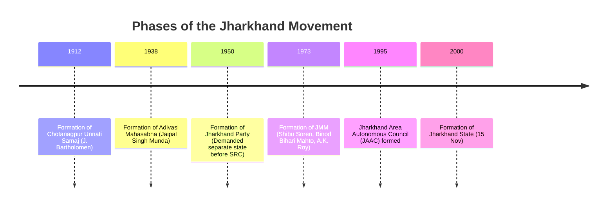

# 📖 Semester 3 | CC-309: State Politics in India
## Unit 1: Dynamics of State Politics & The Jharkhand Movement

---

## 1. Meaning & Evolution of State Politics (राज्य की राजनीति)

**English:**
State Politics in India studies the political processes, institutional dynamics, and electoral behavior at the sub-national level (States). Initially, under the "Congress System" (1952-1967), state politics was heavily centralized. However, after the 1967 elections, the rise of regional parties (like DMK in Tamil Nadu and Akali Dal in Punjab) decentralized Indian politics, making State Politics a vital field of study (as pioneered by scholars like **Myron Weiner** and **Iqbal Narain**).

**Hindi (हिंदी व्याख्या):**
भारत में 'राज्य की राजनीति' उप-राष्ट्रीय स्तर (राज्यों) पर राजनीतिक प्रक्रियाओं, संस्थागत गतिशीलता और चुनावी व्यवहार का अध्ययन करती है। प्रारंभ में, "कांग्रेस प्रणाली" (1952-1967) के तहत, राज्य की राजनीति अत्यधिक केंद्रीकृत थी। हालाँकि, 1967 के चुनावों के बाद, क्षेत्रीय दलों के उदय ने भारतीय राजनीति का विकेंद्रीकरण कर दिया।

---

## 2. Determinants of State Politics (निर्धारक तत्व)

State politics in India is heavily influenced by socio-cultural factors:
1. **Caste (जाति):** Caste equations often determine ticket distribution and voting patterns (e.g., SP and BSP in UP).
2. **Language (भाषा):** The linguistic reorganization of states (1956) made language a core political identity.
3. **Region / Regionalism (क्षेत्रवाद):** Demand for autonomy or separate statehood due to perceived economic deprivation (e.g., Telangana, Jharkhand, Gorkhaland).
4. **Religion (धर्म):** Communal polarization often shapes electoral outcomes in specific states.

---

## 3. The Jharkhand Movement: Historical Background (झारखंड आंदोलन)

The creation of Jharkhand on **15th November 2000** (on the birth anniversary of Birsa Munda) was the culmination of a century-long struggle by the tribal (Adivasi) and local non-tribal (Sadan) populations of the Chotanagpur plateau and Santhal Pargana regions.

### A. Causes of the Movement (आंदोलन के कारण)
1. **Diku Exploitation:** Exploitation of innocent tribals by outsiders/moneylenders, locally called *Dikus*.
2. **Economic Marginalization:** Despite producing 40% of India's minerals, the region suffered severe poverty and displacement due to dams and mines (the "Resource Curse").
3. **Cultural Alienation:** Threat to indigenous languages (Santhali, Mundari, Ho) and tribal customs (Sarna religion).

### B. Timeline of the Movement (आंदोलन का घटनाक्रम)

### C. Key Personalities (प्रमुख व्यक्तित्व)
* **Jaipal Singh Munda:** The "Marang Gomke" (Great Leader). He captained the Indian hockey team to Olympic gold (1928) and led the Jharkhand Party, officially placing the demand for a separate state before the States Reorganisation Commission (SRC) in 1955.
* **Binod Bihari Mahto:** Founder of the *Shivaji Samaj* and co-founder/first President of the Jharkhand Mukti Morcha (JMM). He united the Kurmi (Sadan) and Tribal populations.
* **Shibu Soren:** "Guruji", co-founder of JMM, led massive mass struggles against moneylenders.

---

## 4. Exam-Oriented Summary & Revision Notes

### 🧠 Rapid Revision Notes
- **Father of State Politics Study in India:** Myron Weiner & Iqbal Narain.
- **Jharkhand Formation Date:** 15 November 2000 (28th State of India).
- **Jharkhand Party:** Founded by Jaipal Singh Munda in 1950.
- **JMM Formation (1973):** Formed by the trinity of Shibu Soren (Santhal), Binod Bihari Mahto (Kurmi), and A.K. Roy (Marxist), symbolizing a tribal-non-tribal-left alliance.

### 💡 Memory Tricks / Mnemonics
> **JMM Founders Mnemonic:** **S-B-A**
> **S**hibu Soren, **B**inod Bihari Mahto, **A**.K. Roy.

---

## 5. Question Bank & Model Answers

### A. Very Short Questions (2 Marks)
**Q1. Who is known as 'Marang Gomke' in the history of Jharkhand?**
*Ans:* Jaipal Singh Munda is affectionately known as 'Marang Gomke', which means 'Great Leader' in the Mundari language.

**Q2. What does the term 'Diku' mean in the context of the Jharkhand movement?**
*Ans:* 'Diku' is a term used by the tribal populations of Jharkhand to refer to exploitative outsiders, such as moneylenders, landlords, and corrupt officials.

### B. Long Analytical Questions (12.5 / 15 Marks)
**Q3. Trace the evolution of the Jharkhand Movement. Discuss the socio-economic factors responsible for the demand for a separate state. (BBMKU PYQ)**

**Model Answer Outline:**
1. **Introduction:** Mention the birth of Jharkhand on 15 Nov 2000. State that it was not a sudden political event but the result of decades of socio-economic and cultural struggle.
2. **Socio-Economic Factors:**
   - *Internal Colonialism:* The mineral wealth of South Bihar (Chotanagpur) was extracted to build North Bihar and the rest of India, while locals lived in abject poverty.
   - *Displacement:* Massive displacement of tribals due to PSUs (like HEC, Bokaro Steel) and dams (DVC) without proper rehabilitation.
   - *Exploitation:* Oppression by *Dikus* (outsiders/moneylenders) leading to land alienation.
3. **Evolutionary Phases:**
   - *Phase 1 (1912-1938):* Social reform phase (Chotanagpur Unnati Samaj).
   - *Phase 2 (1938-1963):* Political articulation phase under Jaipal Singh Munda and the Adivasi Mahasabha/Jharkhand Party. Mention the rejection of their demand by the SRC in 1955.
   - *Phase 3 (1973-2000):* Radical/Militant phase under JMM (Shibu Soren, Binod Bihari Mahto). The alliance of tribals and Kurmis.
4. **Political Climax:** Formation of JAAC in 1995, and finally the passage of the Bihar Reorganisation Act in 2000.
5. **Conclusion:** Summarize that the movement was a classic example of sub-nationalism driven by relative deprivation.

### C. UGC NET Specific MCQs (Paper II)
**Q1. The demand for a separate Jharkhand state was first placed before the States Reorganisation Commission (SRC) in 1955 by:**
(A) Shibu Soren
(B) Birsa Munda
(C) Jaipal Singh Munda
(D) Binod Bihari Mahto
*Answer:* (C) Jaipal Singh Munda

**Q2. Who among the following scholars is widely known for pioneering the study of State Politics in India?**
(A) Rajni Kothari
(B) Myron Weiner
(C) Partha Chatterjee
(D) Sudipta Kaviraj
*Answer:* (B) Myron Weiner

**Q3. The state of Jharkhand was carved out of Bihar by which legislative act?**
(A) Jharkhand Reorganisation Act, 2000
(B) Bihar Reorganisation Act, 2000
(C) States Reorganisation Act, 1956
(D) 84th Constitutional Amendment Act, 2000
*Answer:* (B) Bihar Reorganisation Act, 2000

---

## 7. Phase 13 Mega Expansion: High-Yield Questions

### Top Short Questions (2-5 Marks)
**Q1. What was the Birsa Munda 'Ulgulan'?**
*Ans:* The 'Great Tumult' or rebellion (1899-1900) led by Birsa Munda against the British and non-tribal landlords (Dikus) to establish 'Munda Raj'.

**Q2. What is the significance of the CNT Act, 1908?**
*Ans:* The Chota Nagpur Tenancy Act (1908) was enacted to protect the land rights of tribals, prohibiting the transfer of tribal land to non-tribals without the permission of the Deputy Commissioner.

**Q3. Define the 'Resource Curse' in the context of Jharkhand.**
*Ans:* Despite having nearly 40% of India's mineral wealth, Jharkhand suffers from extreme poverty, displacement, and underdevelopment. The abundance of resources has ironically led to poor economic growth for the locals.

**Q4. What is the PESA Act, 1996?**
*Ans:* The Panchayats (Extension to Scheduled Areas) Act extends Part IX of the Constitution to Fifth Schedule areas, giving immense power to Gram Sabhas for self-governance and control over local resources.

**Q5. Who was Binod Bihari Mahto?**
*Ans:* A prominent leader of the Jharkhand movement and founder of the Shivaji Samaj. He co-founded the Jharkhand Mukti Morcha (JMM) alongside Shibu Soren and A.K. Roy.

### Top Long Analytical Questions (15-20 Marks)
**Q1. Trace the historical evolution of the demand for a separate state of Jharkhand.**
*Outline:* Intro -> Early tribal revolts (Santhal, Munda) -> Formation of Unnati Samaj (1915) -> Jaipal Singh Munda & Adivasi Mahasabha -> Formation of Jharkhand Party (1950) -> JMM (1973) -> Bihar Reorganisation Act (2000) -> Conclusion.

**Q2. Discuss the socio-economic impact of industrialization and mining on the tribal population of Jharkhand.**
*Outline:* Intro -> Rich minerals vs Poor people -> Land alienation despite CNT/SPT Acts -> Displacement without adequate rehabilitation (e.g., DVC, HEC) -> Environmental degradation -> Rise of Left-Wing Extremism (LWE) as a byproduct -> Conclusion.

**Q3. Evaluate the working and effectiveness of the PESA Act in the scheduled areas of Jharkhand.**
*Outline:* Intro -> Objectives of PESA -> Powers of Gram Sabha -> Implementation challenges (state govt reluctance, bureaucratic hurdles, overriding by mining laws) -> Impact on tribal autonomy -> Conclusion.

---
*Created as part of the BBMKU M.A. Political Science & UGC NET Master Dashboard Project.*
