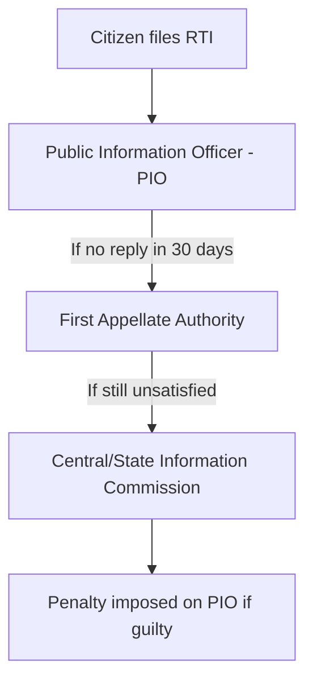

# 📖 Semester 4 | CC-411: Governance and Public Policy in India
## Unit 1: Good Governance, E-Governance, and RTI

---

## 1. Meaning of Governance & Good Governance (शासन और सुशासन)

**English:**
While "Government" refers to the formal institutional structure (the State), **Governance** refers to the *process* of decision-making and the process by which decisions are implemented (or not implemented). 
**Good Governance** is a normative concept popularized by the **World Bank in 1989** (in its report on Sub-Saharan Africa). It implies an administration that is effective, efficient, participatory, and transparent.

**Hindi (हिंदी व्याख्या):**
जहाँ "सरकार" औपचारिक संस्थागत ढांचे (राज्य) को संदर्भित करती है, वहीं **शासन (Governance)** निर्णय लेने की *प्रक्रिया* और उस प्रक्रिया को संदर्भित करता है जिसके द्वारा निर्णयों को लागू किया जाता है।
**सुशासन (Good Governance)** एक मानकीय अवधारणा है जिसे **1989 में विश्व बैंक** द्वारा लोकप्रिय बनाया गया था। इसका अर्थ एक ऐसे प्रशासन से है जो प्रभावी, कुशल, सहभागी और पारदर्शी हो।

### 8 Pillars of Good Governance (World Bank)
1. **Participation (भागीदारी)**
2. **Rule of Law (कानून का शासन)**
3. **Transparency (पारदर्शिता)**
4. **Responsiveness (उत्तरदायित्व)**
5. **Consensus Oriented (सर्वसम्मति उन्मुख)**
6. **Equity and Inclusiveness (समानता और समावेशिता)**
7. **Effectiveness and Efficiency (प्रभावशीलता और दक्षता)**
8. **Accountability (जवाबदेही)**

---

## 2. E-Governance in India (ई-शासन)

E-Governance is the application of Information and Communication Technology (ICT) for delivering government services, exchange of information, and integration of various systems between government and citizens.

**Objectives:** SMART Governance
- **S**imple (सरल)
- **M**oral (नैतिक)
- **A**ccountable (जवाबदेह)
- **R**esponsive (उत्तरदायी)
- **T**ransparent (पारदर्शी)

**Major E-Governance Initiatives in India:**
- **National e-Governance Plan (NeGP - 2006):** "Make all Government services accessible to the common man in his locality."
- **Digital India (2015):** To transform India into a digitally empowered society and knowledge economy.
- **MyGov, UMANG App, DigiLocker, PRAGATI (Pro-Active Governance And Timely Implementation).**

---

## 3. Right to Information Act, 2005 (सूचना का अधिकार)

The RTI Act, 2005 is a landmark legislation in India that replaced the draconian *Official Secrets Act, 1923*. It operationalizes the fundamental right to freedom of speech and expression (Article 19(1)(a)).

### Genesis of RTI in India
The grassroots struggle was led by **Mazdoor Kisan Shakti Sangathan (MKSS)**, founded by Aruna Roy in Rajasthan in the 1990s. They demanded transparency in village panchayat funds ("Our Money, Our Accounts").

### Key Features of RTI Act 2005:
- **Coverage:** Applies to all Constitutional authorities, bodies owned/controlled by the state, and NGOs substantially funded by the government.
- **Time Limit:** Information must be provided within **30 days**. In cases involving the life and liberty of a person, the limit is **48 hours**.
- **Exemptions (Section 8):** Information affecting national sovereignty, security, intellectual property, and cabinet papers are exempt.
- **Structure:** Central Information Commission (CIC) at the center and State Information Commissions (SIC) at the state level.

---

## 4. Exam-Oriented Summary & Revision Notes

### 🧠 Rapid Revision Notes
- **Good Governance:** Coined by World Bank (1989). 8 Pillars.
- **SMART Governance:** Simple, Moral, Accountable, Responsive, Transparent.
- **RTI Act:** Passed in 2005. Rooted in MKSS movement (Aruna Roy).
- **RTI Time Limit:** 30 days (Normal), 48 hours (Life & Liberty).
- **PRAGATI:** ICT platform used by the PM to monitor and review government programs.

### 💡 Memory Tricks / Mnemonics
> **Good Governance 8 Pillars Mnemonic:** **P-R-T-R-C-E-E-A**
> *Please Read The Rules Carefully, Every Exam Awaits.*
> (Participation, Rule of law, Transparency, Responsiveness, Consensus, Equity, Effectiveness, Accountability)

---

## 5. Question Bank & Model Answers

### A. Very Short Questions (2 Marks)
**Q1. Which international institution popularized the concept of 'Good Governance'?**
*Ans:* The World Bank popularized the concept in its 1989 report on Sub-Saharan Africa.

**Q2. What is the time limit for an RTI reply if the information concerns the life and liberty of a person?**
*Ans:* The information must be provided within 48 hours.

### B. Long Analytical Questions (12.5 / 15 Marks)
**Q3. Discuss the concept of Good Governance. How has E-Governance contributed to achieving Good Governance in India? (UGC NET & M.A. PYQ)**

**Model Answer Outline:**
1. **Introduction:** Differentiate between traditional 'Government' (institutions) and 'Governance' (processes). Introduce the World Bank's 1989 definition.
2. **The 8 Pillars of Good Governance:** Briefly explain Transparency, Accountability, Participation, Rule of Law, etc.
3. **The Role of E-Governance:** Define E-governance (Application of ICT). Explain how it directly targets the pillars of Good Governance:
   - *Transparency:* Portals like Government e-Marketplace (GeM) eliminate middleman corruption.
   - *Accountability:* Digital tracking of files and PRAGATI meetings.
   - *Effectiveness:* Direct Benefit Transfer (DBT) and Aadhaar have saved billions by eliminating ghost beneficiaries.
   - *Responsiveness:* Twitter handles of ministries, UMANG app.
4. **Challenges:** Digital divide, poor internet connectivity in rural areas, cybersecurity threats.
5. **Conclusion:** E-governance is not a magic bullet, but it is the most powerful tool available today to shift administration from being 'opaque and rigid' to 'SMART' (Simple, Moral, Accountable, Responsive, Transparent).

### C. UGC NET Specific MCQs (Paper II)
**Q1. The Mazdoor Kisan Shakti Sangathan (MKSS), which played a crucial role in the RTI movement, was based in which state?**
(A) Maharashtra
(B) Rajasthan
(C) Gujarat
(D) Bihar
*Answer:* (B) Rajasthan

**Q2. Under the RTI Act 2005, which section deals with the 'Exemption from disclosure of information'?**
(A) Section 4
(B) Section 6
(C) Section 8
(D) Section 20
*Answer:* (C) Section 8

**Q3. The concept of 'SMART' governance was articulated in India primarily in the context of:**
(A) Panchayati Raj Institutions
(B) E-Governance initiatives
(C) Police Reforms
(D) Electoral Reforms
*Answer:* (B) E-Governance initiatives

---

## 7. Phase 14 Mega Expansion: High-Yield Questions

### Top 10 Short Questions (2-5 Marks)
**Q1. What is the RTI Act 2005?**
*Ans:* The Right to Information Act empowers citizens to seek information from public authorities, promoting transparency and accountability in governance.

**Q2. What is 'Good Governance'?**
*Ans:* A concept promoted by the World Bank (1989). It involves participatory, transparent, accountable, effective, equitable governance based on the rule of law.

**Q3. Define 'E-Governance'.**
*Ans:* The use of ICT to deliver government services, exchange information, and integrate systems across government (G2C, G2B, G2G).

**Q4. What is the 'Digital India' initiative?**
*Ans:* A flagship programme launched in 2015 to transform India into a digitally empowered society with digital infrastructure, digital literacy, and digital delivery of services.

**Q5. What is 'SMART' governance?**
*Ans:* Simple, Moral, Accountable, Responsive, Transparent governance—the guiding principle of Indian e-governance reforms.

**Q6. Define 'Public Policy' per Thomas Dye.**
*Ans:* "Public policy is whatever governments choose to do or not to do."

**Q7. What is the Incremental Model of policy-making?**
*Ans:* Charles Lindblom's model ("Muddling Through") where policy changes are made in small, gradual steps rather than through comprehensive rational planning.

**Q8. What is NITI Aayog?**
*Ans:* National Institution for Transforming India (est. 2015), replacing the Planning Commission. It acts as a think tank providing strategic policy inputs.

**Q9. What is 'Citizen's Charter'?**
*Ans:* A document that outlines an organization's commitment to provide services to citizens within a specified timeframe and quality, enhancing accountability.

**Q10. Differentiate between Lokpal and Lokayukta.**
*Ans:* Lokpal is the anti-corruption ombudsman at the national level (Lokpal Act 2013). Lokayukta operates at the state level (first in Maharashtra, 1971).

### Top 10 Long Analytical Questions (15-20 Marks)
**Q1. Discuss the concept of 'Good Governance' and its key characteristics as outlined by the World Bank.**
*Outline:* Intro -> Context (1989 World Bank report) -> 8 characteristics -> Relevance to India -> RTI, E-governance as tools -> Conclusion.

**Q2. Evaluate the role and effectiveness of the RTI Act 2005 in promoting transparency in India.**
*Outline:* Intro -> Background (Mazdoor Kisan Shakti Sangathan, Aruna Roy) -> Key provisions (Sec 4, 6, 8, 19) -> Achievements -> Challenges (threats to activists, low awareness) -> Conclusion.

**Q3. Analyze the impact of E-Governance initiatives on public administration in India.**
*Outline:* Intro -> Definition -> Key initiatives (Digital India, Aadhaar, DBT, UMANG) -> Impact on transparency & efficiency -> Challenges (digital divide, cyber security) -> Conclusion.

**Q4. Critically examine the Incremental Model of Public Policy Formulation.**
*Outline:* Intro -> Charles Lindblom's "Muddling Through" -> Bounded Rationality (Simon's influence) -> Criticism (conservative bias, ignores fundamental issues) -> Conclusion.

**Q5. Discuss the evolution and role of NITI Aayog and compare it with the erstwhile Planning Commission.**
*Outline:* Intro -> Planning Commission (1950-2014, top-down) -> NITI Aayog (2015, bottom-up, cooperative federalism) -> Key differences (Advisory vs Directive) -> Conclusion.

---

> [!IMPORTANT]
> ### 🎓 UGC NET Expert Tips for Governance & Public Policy
> 1. **RTI Act:** Section 4 = Proactive Disclosure. Section 6 = How to file. Section 8 = Exemptions. Section 19 = Appeal.
> 2. **E-Governance Models:** G2C (Government to Citizen), G2B (Government to Business), G2G (Government to Government), G2E (Government to Employee).
> 3. **Policy Models:** Rational-Comprehensive vs Incremental (Lindblom). Systems Model (Easton's Input-Output). Elite Model. Group Model.
> 4. **Key committees:** 2nd ARC (Administrative Reforms Commission) by Veerappa Moily recommended SMART governance.

---
*Created as part of the BBMKU M.A. Political Science & UGC NET Master Dashboard Project.*
