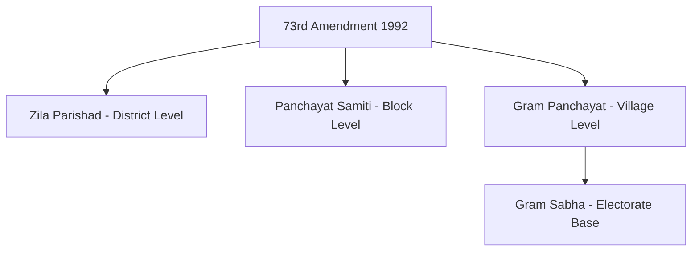

# 📖 Semester 4 | DCE-401: Local Self Government in India
## Unit 1: Panchayati Raj Institutions (73rd Amendment)

---

## 1. Meaning & Historical Background (अर्थ और ऐतिहासिक पृष्ठभूमि)

**English:**
Local Self-Government refers to the management of local affairs by such local bodies which have been elected by the local people. The idea of *Panchayati Raj* (village self-governance) was a core philosophy of Mahatma Gandhi, who advocated for **Gram Swaraj** (village republic). He believed that true democracy must be built from the bottom up.

**Hindi (हिंदी व्याख्या):**
स्थानीय स्वशासन से तात्पर्य स्थानीय लोगों द्वारा चुने गए स्थानीय निकायों द्वारा स्थानीय मामलों के प्रबंधन से है। *पंचायती राज* (ग्राम स्वशासन) का विचार महात्मा गांधी का मुख्य दर्शन था, जिन्होंने **ग्राम स्वराज** (ग्राम गणराज्य) की वकालत की। उनका मानना था कि सच्चा लोकतंत्र नीचे से ऊपर (bottom-up) की ओर बनाया जाना चाहिए।

### Evolution of Panchayati Raj Post-Independence
To implement Gandhi's vision (enshrined in **Article 40** of DPSP), the Government of India appointed several committees:

1. **Balwant Rai Mehta Committee (1957):** Recommended a 3-tier system (Village, Block, District). Rajasthan (Nagaur district) was the first state to establish it in 1959.
2. **Ashok Mehta Committee (1977):** Recommended a 2-tier system (Zila Parishad and Mandal Panchayat).
3. **G.V.K. Rao Committee (1985):** Highlighted the bureaucratization of development ("grass without roots").
4. **L.M. Singhvi Committee (1986):** Recommended **Constitutional status** for Panchayati Raj Institutions (PRIs).

---

## 2. The 73rd Constitutional Amendment Act, 1992 (73वां संशोधन)

The 73rd Amendment Act gave constitutional status to PRIs. It added **Part IX** to the Constitution and a new **11th Schedule** containing 29 functional items for Panchayats.

### Key Provisions (मुख्य प्रावधान)

**A. Compulsory (Mandatory) Provisions:**
1. **Gram Sabha:** Establishment of a Gram Sabha (village assembly) in every village.
2. **Three-Tier System:** Village, Intermediate (Block), and District levels (States with population under 20 lakhs may skip the intermediate level).
3. **Direct Elections:** Members at all levels must be elected directly by the people.
4. **Reservation of Seats:**
   - For SCs and STs in proportion to their population.
   - For **Women: Not less than 1/3rd (33%)** of the total seats.
5. **Fixed Tenure:** A 5-year term. If dissolved earlier, fresh elections must be held within 6 months.
6. **State Election Commission (SEC):** To conduct panchayat elections.
7. **State Finance Commission (SFC):** Constituted every 5 years to review the financial position of panchayats.

**B. Voluntary (Discretionary) Provisions:**
1. Giving representation to MPs and MLAs in the panchayats.
2. Providing reservation for Backward Classes (OBCs).
3. Granting financial powers (taxes, tolls, fees) to the panchayats.

---

## 3. PESA Act, 1996 (पेसा अधिनियम)

The Provisions of the Panchayats (Extension to the Scheduled Areas) Act, 1996, extended the 73rd Amendment to the Schedule V areas (tribal areas in states like Jharkhand, Chhattisgarh, MP, etc.) with certain modifications.
- **Objective:** To recognize the traditional rights of tribals over natural resources and prevent their marginalization.
- **Power to Gram Sabha:** Under PESA, the Gram Sabha is supreme. It has the power to approve plans, manage minor water bodies, control minor forest produce, and prevent land alienation.

---

## 4. Exam-Oriented Summary & Revision Notes

### 🧠 Rapid Revision Notes
- **Article 40:** Directs the state to organize village panchayats (Gandhian DPSP).
- **First State:** Rajasthan (Nagaur, 2nd Oct 1959).
- **11th Schedule:** Contains 29 subjects transferred to Panchayats.
- **Reservation:** Minimum 33% for women (many states like Bihar and Jharkhand now provide 50%).
- **PESA Act (1996):** Extends Panchayati Raj to Fifth Schedule tribal areas.

### 💡 Memory Tricks / Mnemonics
> **Committees Chronology Mnemonic:** **B-A-G-S**
> **B**alwant Rai Mehta (1957)
> **A**shok Mehta (1977)
> **G**.V.K. Rao (1985)
> L.M. **S**inghvi (1986)

---

## 5. Question Bank & Model Answers

### A. Very Short Questions (2 Marks)
**Q1. What is the Gram Sabha?**
*Ans:* The Gram Sabha is the foundation of the Panchayati Raj system. It consists of all persons registered in the electoral rolls relating to a village comprised within the area of the Panchayat.

**Q2. Which committee recommended granting Constitutional status to Panchayati Raj Institutions?**
*Ans:* The L.M. Singhvi Committee (1986) recommended granting constitutional status to PRIs.

### B. Long Analytical Questions (12.5 / 15 Marks)
**Q3. Critically analyze the impact of the 73rd Constitutional Amendment Act on grassroots democracy in India, particularly focusing on women's empowerment. (UGC NET & M.A. PYQ)**

**Model Answer Outline:**
1. **Introduction:** Define democratic decentralization. Introduce the 73rd Amendment (1992) as a watershed moment that transformed representative democracy into participatory democracy.
2. **Transformative Impact:**
   - *Regular Elections:* Broke the stranglehold of state governments that used to arbitrarily dissolve panchayats.
   - *Institutionalized Gram Sabha:* Gave a direct voice to the villagers.
3. **Women's Empowerment:**
   - Explain the 33% reservation mandate (Article 243D).
   - *Positive Impact:* Brought millions of women into political leadership, breaking traditional patriarchal barriers. Shifted policy focus towards water, health, and education.
   - *Challenges (The 'Sarpanch Pati' Phenomenon):* Mention the proxy rule where husbands/fathers wield actual power while the elected woman acts as a rubber stamp.
4. **Overall Deficits:** Lack of 3 Fs (Funds, Functions, Functionaries). State governments are reluctant to devolve real power.
5. **Conclusion:** Despite flaws like 'Sarpanch Patis' and inadequate funding, the 73rd Amendment has irreversibly changed the political landscape, creating a massive training ground for future political leaders.

### C. UGC NET Specific MCQs (Paper II)
**Q1. Which Schedule was added to the Constitution by the 73rd Amendment Act?**
(A) 9th Schedule
(B) 10th Schedule
(C) 11th Schedule
(D) 12th Schedule
*Answer:* (C) 11th Schedule

**Q2. The Balwant Rai Mehta Committee was appointed in which year?**
(A) 1957
(B) 1977
(C) 1985
(D) 1992
*Answer:* (A) 1957

**Q3. Under the 73rd Amendment, the minimum age to contest panchayat elections is:**
(A) 18 years
(B) 21 years
(C) 25 years
(D) 30 years
*Answer:* (B) 21 years

---

## 7. Phase 14 Mega Expansion: High-Yield Questions

### Top Short Questions (2-5 Marks)
**Q1. What is the 73rd Amendment Act 1992?**
*Ans:* It constitutionalized the 3-tier Panchayati Raj system and introduced provisions for regular elections, reservation for SCs/STs/women, and State Election/Finance Commissions.

**Q2. Name the three tiers of Panchayati Raj.**
*Ans:* Gram Panchayat (Village), Panchayat Samiti (Block), and Zila Parishad (District).

**Q3. What is the role of the State Finance Commission?**
*Ans:* To review the financial position of Panchayats and make recommendations regarding allocation of taxes, duties, tolls, and grants from the state government.

**Q4. What is the Balwant Rai Mehta Committee (1957)?**
*Ans:* It recommended the establishment of a 3-tier democratic decentralized system (Panchayati Raj) in India.

**Q5. What is the 74th Amendment Act?**
*Ans:* It constitutionalized Urban Local Bodies (Municipalities, Municipal Corporations, Nagar Panchayats) similar to how the 73rd did for rural bodies.

### Top Long Analytical Questions (15-20 Marks)
**Q1. Evaluate the impact of the 73rd and 74th Constitutional Amendment Acts on democratic decentralization in India.**
*Outline:* Intro -> Historical background (Mehta, Ashok Mehta committees) -> Key provisions -> Successes -> Failures (lack of 3Fs: Funds, Functions, Functionaries) -> Conclusion.

**Q2. Discuss the role and challenges of women's reservation in Panchayati Raj Institutions.**
*Outline:* Intro -> 33% reservation -> Women sarpanches -> Sarpanch-Pati syndrome -> Empowerment vs tokenism -> Conclusion.

---
*Created as part of the BBMKU M.A. Political Science & UGC NET Master Dashboard Project.*
