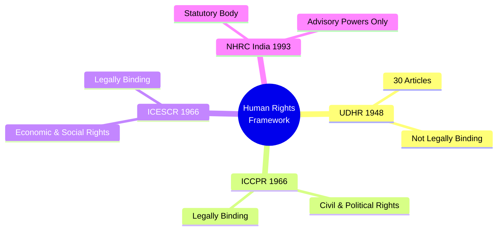

# 📖 Semester 4 | DCE-402: Human Rights
## Unit 1: Evolution, Theories, and International Framework (UDHR)

---

## 1. Meaning & Evolution of Human Rights (मानवाधिकार का अर्थ एवं विकास)

**English:**
Human rights are basic moral guarantees that people in all countries and cultures possess simply because they are human beings. They are inalienable, universal, and indivisible. The modern conception of human rights emerged after the atrocities of World War II, culminating in the adoption of the Universal Declaration of Human Rights (UDHR) in 1948.

**Hindi (हिंदी व्याख्या):**
मानवाधिकार वे बुनियादी नैतिक अधिकार हैं जो सभी देशों और संस्कृतियों के लोगों को केवल इसलिए प्राप्त हैं क्योंकि वे इंसान हैं। ये अविच्छेद्य (inalienable), सार्वभौमिक (universal) और अविभाज्य (indivisible) हैं। मानवाधिकारों की आधुनिक अवधारणा द्वितीय विश्व युद्ध के अत्याचारों के बाद उभरी, जिसकी परिणति 1948 में मानवाधिकारों की सार्वभौम घोषणा (UDHR) को अपनाने के रूप में हुई।

### The Three Generations of Human Rights (Karel Vasak's Classification)
1. **First Generation (Blue Rights):** Civil and Political Rights. (Focus: Liberty). Protects the individual from the state (e.g., Freedom of speech, right to vote). Rooted in the French & American Revolutions.
2. **Second Generation (Red Rights):** Economic, Social, and Cultural Rights. (Focus: Equality). Requires the state to provide basic needs (e.g., Right to education, right to work). Rooted in the Socialist/Russian Revolution.
3. **Third Generation (Green Rights):** Solidarity or Collective Rights. (Focus: Fraternity). e.g., Right to a clean environment, right to self-determination, right to development.

---

## 2. Theories of Human Rights (मानवाधिकार के सिद्धांत)

1. **Theory of Natural Rights (John Locke):** Rights are derived from nature or God, not from the state. Humans have the natural right to *Life, Liberty, and Property*.
2. **Legal Theory of Rights (Jeremy Bentham):** Rights are created and enforced by the laws of the state. Bentham famously called natural rights "nonsense upon stilts."
3. **Historical Theory of Rights (Edmund Burke):** Rights are the product of historical evolution and customs, not abstract natural laws.
4. **Social Welfare Theory (Laski):** Rights are the conditions of social life without which no man can seek to be himself at his best.

---

## 3. The Universal Declaration of Human Rights (UDHR - 1948)

The UDHR was adopted by the UN General Assembly on **10th December 1948** (celebrated globally as Human Rights Day). It was drafted by a committee chaired by **Eleanor Roosevelt**.

**Key Features:**
- It consists of a Preamble and **30 Articles**.
- Articles 1-21 deal with First Generation Rights (Civil & Political).
- Articles 22-27 deal with Second Generation Rights (Economic, Social, & Cultural).
- It is a "Declaration," meaning it is **not legally binding** on states, but it has attained the status of customary international law.

To make these rights legally binding, the UN later adopted the two international covenants in 1966 (ICCPR and ICESCR). Together with the UDHR, they form the **International Bill of Human Rights**.

---

## 4. National Human Rights Commission of India (NHRC)

Established on 12 October 1993 under the *Protection of Human Rights Act, 1993*.
- **Nature:** It is a Statutory Body (not a constitutional body).
- **Composition:** A Chairperson (must be a retired Chief Justice or Judge of the Supreme Court) and 5 other members.
- **Appointment:** Appointed by the President on the recommendation of a 6-member committee headed by the Prime Minister.
- **Term:** 3 years or until the age of 70 (whichever is earlier) - *Amended in 2019*.
- **Role:** It acts as a "watchdog" of human rights in India, but its recommendations are strictly **advisory** in nature.

---

## 5. Exam-Oriented Summary & Revision Notes

### 🧠 Rapid Revision Notes
- **Father of Natural Rights:** John Locke (Life, Liberty, Property).
- **Human Rights Day:** 10th December (Adoption of UDHR).
- **UDHR Articles:** 30.
- **Karel Vasak's 3 Generations:** Liberty (1st), Equality (2nd), Fraternity (3rd).
- **NHRC Nature:** Statutory, Advisory body. "A toothless tiger."

### 💡 Memory Tricks / Mnemonics
> **NHRC Selection Committee Mnemonic:** **P-H-S-L-D-D**
> **P**rime Minister, **H**ome Minister, **S**peaker (Lok Sabha), **L**eader of Opposition (LS), **D**eputy Chairman (Rajya Sabha), **D**eputy/Leader of Opposition (RS).

---

## 6. Question Bank & Model Answers

### A. Very Short Questions (2 Marks)
**Q1. What are the "Three Generations" of human rights?**
*Ans:* Classified by Karel Vasak, they are: 1st Gen (Civil-Political/Liberty), 2nd Gen (Economic-Social/Equality), and 3rd Gen (Solidarity/Fraternity).

**Q2. When is Human Rights Day celebrated and why?**
*Ans:* It is celebrated on 10th December every year to commemorate the UN General Assembly's adoption of the UDHR in 1948.

### B. Long Analytical Questions (12.5 / 15 Marks)
**Q3. Evaluate the composition and functions of the National Human Rights Commission (NHRC). Why is it often called a "toothless tiger"? (BBMKU PYQ)**

**Model Answer Outline:**
1. **Introduction:** Define NHRC. Mention its establishment in 1993 under the Protection of Human Rights Act to act as the watchdog of human rights in India, fulfilling the Paris Principles.
2. **Composition & Appointment:** Detail the structure (Chairman + 5 members) and the high-powered selection committee headed by the PM, ensuring autonomy.
3. **Functions:**
   - Inquire into violations of human rights (suo motu or on petition).
   - Visit jails to study living conditions.
   - Promote human rights literacy and research.
4. **The "Toothless Tiger" Critique:**
   - Its recommendations are purely *advisory*; it cannot punish violators.
   - It cannot award financial relief directly.
   - It has limited jurisdiction over armed forces (can only seek reports from the central government).
   - It must investigate a case within one year of its occurrence.
5. **Conclusion:** While it lacks penal powers, the NHRC plays a massive moral role in naming and shaming violators and educating the public. Strengthening it requires giving its recommendations binding force.

### C. UGC NET Specific MCQs (Paper II)
**Q1. The Universal Declaration of Human Rights (UDHR) was adopted by the UN General Assembly in:**
(A) 1945
(B) 1948
(C) 1950
(D) 1966
*Answer:* (B) 1948

**Q2. Who among the following famously described natural rights as "nonsense upon stilts"?**
(A) John Locke
(B) Thomas Hobbes
(C) Jeremy Bentham
(D) J.S. Mill
*Answer:* (C) Jeremy Bentham

**Q3. The chairperson of the NHRC holds office for a term of:**
(A) 5 years or till the age of 70
(B) 5 years or till the age of 65
(C) 3 years or till the age of 70
(D) 3 years or till the age of 65
*Answer:* (C) 3 years or till the age of 70 (Post 2019 Amendment)

## 8. Phase 14 Mega Expansion: High-Yield Questions

### Top Short Questions (2-5 Marks)
**Q1. What is the UDHR (1948)?**
*Ans:* The Universal Declaration of Human Rights, a milestone document adopted by UNGA on Dec 10, 1948, proclaiming 30 articles of inalienable rights for all.

**Q2. Who said natural rights are "nonsense upon stilts"?**
*Ans:* Jeremy Bentham; he was a utilitarian who rejected the concept of natural/inherent rights.

**Q3. What is the NHRC?**
*Ans:* National Human Rights Commission (est. 1993 under Protection of Human Rights Act); headed by a retired CJI; investigates human rights violations in India.

**Q4. What are the three generations of human rights?**
*Ans:* 1st Gen: Civil & Political (Liberty). 2nd Gen: Economic, Social & Cultural (Equality). 3rd Gen: Collective/Solidarity (Fraternity/Development).

**Q5. Define the 'International Bill of Human Rights'.**
*Ans:* The collective name for UDHR (1948) + ICCPR (1966) + ICESCR (1966), forming the foundation of international human rights law.

### Top Long Analytical Questions (15-20 Marks)
**Q1. Discuss the three generations of human rights as classified by Karel Vasak.**
*Outline:* Intro -> 1st Gen (Civil/Political, negative rights, linked to French Revolution's Liberty) -> 2nd Gen (Economic/Social, positive rights, Equality) -> 3rd Gen (Collective, Solidarity/Development, Fraternity) -> Conclusion.

**Q2. Critically evaluate the role and effectiveness of the NHRC in protecting human rights in India.**
*Outline:* Intro -> Composition and powers -> Achievements -> Limitations (no enforcement power, only recommends, understaffed, government resistance) -> Conclusion.

---
*Created as part of the BBMKU M.A. Political Science & UGC NET Master Dashboard Project.*
